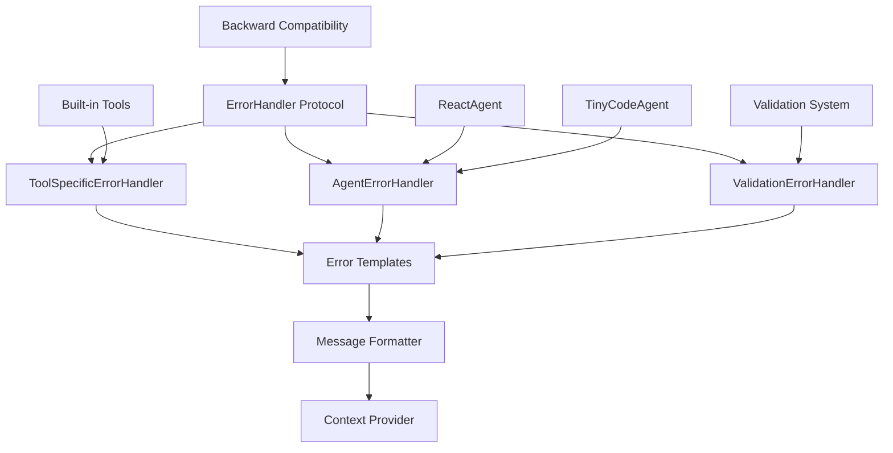

# ErrorHandler Strategy Implementation Plan

## Summary

This document outlines the comprehensive strategy to eliminate hardcoded error messages throughout the tinyagent codebase by implementing a centralized ErrorHandler system. The solution addresses maintenance issues and tight coupling caused by scattered error handling logic.

## Problem Analysis

### Current State Issues

1. **Tool Functions - Hardcoded Error Strings**
   - `web_search()`: `"Error: BRAVE_SEARCH_API_KEY environment variable not set"`
   - `web_browse()`: `"Error: markdownify library not installed. Run: pip install markdownify"`
   - Planning tools: Static `"Plan with id '{plan_id}' not found"` messages

2. **Agent Error Formatting - Hardcoded Prefixes**
   - `ReactAgent._safe_tool()`: Returns `"ArgError: {exc}"` and `"ToolError: {exc}"`
   - `TinyCodeAgent`: Static `"KeyError: {e}"` and `"Execution error: {e}"` messages

3. **Validation Errors - Static Messages**
   - `ToolValidationError`: Consolidated but still static error lists
   - Multiple hardcoded error strings throughout validation logic

4. **Maintenance Challenges**
   - Error messages scattered across multiple files
   - No centralized way to modify error messaging style
   - Tight coupling between error logic and presentation
   - Difficult to provide context-aware error hints

## Proposed Solution

### Architecture Overview



### Core Components

#### 1. ErrorHandler Protocol (`tinyagent/error_handler/__init__.py`)
```python
from abc import ABC, abstractmethod
from typing import Any, Dict, Optional

class ErrorHandler(ABC):
    """Protocol for error handling implementations."""

    @abstractmethod
    def format_error(
        self,
        error: Exception,
        context: Optional[Dict[str, Any]] = None
    ) -> str:
        """Format an error with optional context."""
        pass

    @abstractmethod
    def get_error_hint(self, error_type: str, context: Optional[Dict[str, Any]] = None) -> Optional[str]:
        """Get contextual hint for error resolution."""
        pass
```

#### 2. ToolSpecificErrorHandler (`tinyagent/error_handler/tool_handler.py`)
- Uses tool schemas to provide context-aware error messages
- Eliminates hardcoded strings in tool functions
- Provides tool-specific error hints and resolution suggestions
- Supports error template substitution with tool metadata

#### 3. AgentErrorHandler (`tinyagent/error_handler/agent_handler.py`)
- Centralizes agent-level error formatting
- Replaces hardcoded "ArgError:" and "ToolError:" prefixes
- Provides context-aware error aggregation and reporting
- Supports different error severity levels and formatting styles

#### 4. Error Templates System (`tinyagent/error_handler/templates.py`)
- Centralized error message templates with substitution support
- Configurable error message styles and formats
- Support for internationalization and localization
- Template inheritance and customization capabilities

#### 5. Backward Compatibility Layer
- Gradual migration strategy with existing APIs
- Feature flags to enable/disable new error handling
- Deprecation warnings for old error patterns
- Migration utilities for existing code

### Directory Structure

```
tinyagent/
├── error_handler/
│   ├── __init__.py              # ErrorHandler protocol and public API
│   ├── base.py                  # Abstract base classes
│   ├── tool_handler.py          # ToolSpecificErrorHandler implementation
│   ├── agent_handler.py         # AgentErrorHandler implementation
│   ├── validation_handler.py    # ValidationErrorHandler implementation
│   ├── templates.py             # Error message templates system
│   ├── formatter.py             # Message formatting utilities
│   ├── compatibility.py         # Backward compatibility layer
│   └── registry.py              # ErrorHandler registry and configuration
```

## Implementation Phases

### Phase 1: Foundation (Priority: High)
1. **Create ErrorHandler Protocol**
   - Define abstract base classes and interfaces
   - Establish error context data structures
   - Create error template system with substitution support

2. **Implement Base ErrorHandlers**
   - ToolSpecificErrorHandler with tool schema integration
   - AgentErrorHandler with configurable formatting
   - ValidationErrorHandler for validation system

### Phase 2: Integration (Priority: High)
3. **Update Agent Classes**
   - Modify `ReactAgent._safe_tool()` to use AgentErrorHandler
   - Update `TinyCodeAgent` error handling to use new system
   - Maintain backward compatibility during transition

4. **Update Built-in Tools**
   - Refactor `web_search()`, `web_browse()`, and planning tools
   - Replace hardcoded error strings with ErrorHandler calls
   - Add tool-specific error hints and resolution suggestions

### Phase 3: Testing & Documentation (Priority: Medium)
5. **Comprehensive Testing**
   - Unit tests for all ErrorHandler components
   - Integration tests for error handling scenarios
   - Backward compatibility tests

6. **Documentation and Migration**
   - Update API documentation with new error handling
   - Create migration guide for developers
   - Add examples showing new error handling capabilities

## Design Principles

### 1. Single Source of Truth
- All error message templates centrally managed
- Error formatting logic isolated from business logic
- Consistent error presentation across all components

### 2. Context-Aware Error Reporting
- Error messages adapt to tool schemas and execution context
- Provide actionable hints for error resolution
- Support different error severity levels and formatting

### 3. Backward Compatibility
- Existing APIs continue to work during migration
- Feature flags for gradual rollout
- Clear deprecation path with migration utilities

### 4. Extensibility
- Plugin architecture for custom error handlers
- Template system supports customization
- Registry pattern for dynamic handler configuration

## Migration Strategy

### Step-by-Step Migration

1. **Phase 1**: Implement ErrorHandler system alongside existing code
2. **Phase 2**: Add feature flags to enable new error handling selectively
3. **Phase 3**: Migrate high-frequency error paths (tools, agents)
4. **Phase 4**: Migrate validation and infrastructure errors
5. **Phase 5**: Remove deprecated error handling paths

### Backward Compatibility Guarantees

- Existing error message formats remain available
- No breaking changes to public APIs during migration
- Gradual deprecation with clear migration path
- Feature flags allow incremental adoption

## Benefits

### Immediate Benefits
- Eliminates hardcoded error strings scattered throughout codebase
- Centralizes error message management and styling
- Provides context-aware error hints and resolution suggestions
- Enables consistent error presentation across all components

### Long-term Benefits
- Easier maintenance and updates to error messaging
- Support for internationalization and localization
- Extensible architecture for custom error handling
- Better debugging experience with rich error context

### Developer Experience Improvements
- Clearer error messages with actionable hints
- Consistent error formatting across all tools
- Easier debugging with contextual error information
- Simplified error handling in custom tools

## Success Metrics

### Code Quality Metrics
- Zero hardcoded error strings in tool functions
- 100% test coverage for ErrorHandler components
- No regression in existing error handling functionality

### Developer Experience Metrics
- Reduced time to debug tool execution errors
- Improved error message clarity and usefulness
- Successful migration of all built-in tools and agents

## Risks and Mitigations

### Risk 1: Breaking Changes
- **Mitigation**: Strong backward compatibility layer with feature flags
- **Mitigation**: Comprehensive testing before deprecating old patterns

### Risk 2: Performance Impact
- **Mitigation**: Efficient template system with caching
- **Mitigation**: Lazy loading of error handlers and templates

### Risk 3: Complexity
- **Mitigation**: Clear separation of concerns and simple APIs
- **Mitigation**: Comprehensive documentation and examples

## Next Steps

1. **Review and approve this plan** with stakeholders
2. **Create implementation branch** with base ErrorHandler protocol
3. **Implement core ErrorHandler components** following the phase structure
4. **Run comprehensive tests** and ensure backward compatibility
5. **Gradually migrate existing code** to use new error handling system
6. **Update documentation** and provide migration guidance

This ErrorHandler strategy will significantly improve the maintainability, consistency, and developer experience of error handling throughout the tinyagent codebase while ensuring a smooth migration path with no breaking changes.
