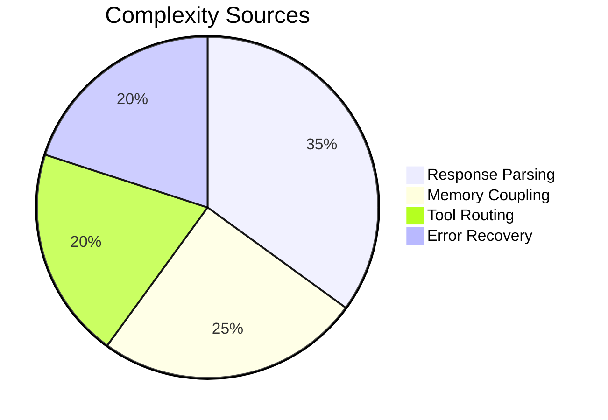

# ReactAgent Refactoring Plan

## Objectives

- **Modularity**: Break `_process_step` into atomic subfunctions
- **Debugging**: Improve step isolation/observability
- **Context Integrity**: Maintain valid LLM message chains

## Key Issues

1. `_process_step` implements 7 responsibilities
2. Scratchpads break LLM role continuity (`user` instead of `assistant`)
3. No token budgeting before API calls
4. Unbounded temperature increments

## Proposed Phases

### Phase 1: Decomposition (3 days)

- Extract core flows into:
  - `_handle_llm_response()`: Parse/validate LLM output
  - `_route_action()`: Scratchpad/tool/answer decision
  - `_adjust_temperature()`: Controlled error response
- Create `StepState` dataclass

### Phase 2: State Isolation (2 days)

- Introduce intermediate `AgentState`:
  ```python
  @dataclass
  class AgentState:
      messages: list[dict]
      temperature: float
      step_count: int
      last_error: str | None
  ```
- Separate memory serialization from control flow

### Phase 3: LLM Optimization (1 day)

- Add token counting via `tiktoken`
- Implement gradient temperature scaling
- Final answer compression strategy

## Detailed Tasks

| Task                      | LOC Target | Dependency |
| ------------------------- | ---------- | ---------- |
| Extract response parsing  | 15 LOC     | Phase 1    |
| Create action router      | 20 LOC     | Phase 1    |
| Token-aware memory prune  | 30 LOC     | Phase 3    |
| Temperature governor      | 10 LOC     | Phase 1/3  |
| Scratchpad role migration | 8 LOC      | Phase 2    |

## Open Questions

1. Should scratchpads be `assistant` role? _(Context chain integrity vs spec compliance)_
2. Max temperature cap? _(Current: ∞, Proposal: 1.5)_
3. Token counting backend: `tiktoken` vs `transformers`?

## Risk Mitigation

- **Parallel Testing**: Maintain legacy+new paths via feature flag
- **Step Tagging**: Add `step_version: 2` metadata
- **Metrics Collection**: Log step breakdown timing



one thing to note that it is in both react and code agents this is not accetable and breaks multiple codebase standars, it a a dupe of logic that extends Complexity, shoud be made in base a class and imported in!
