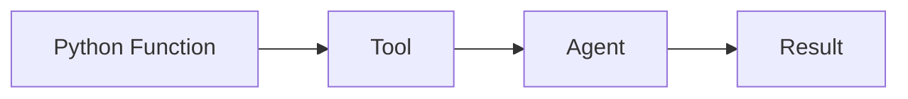
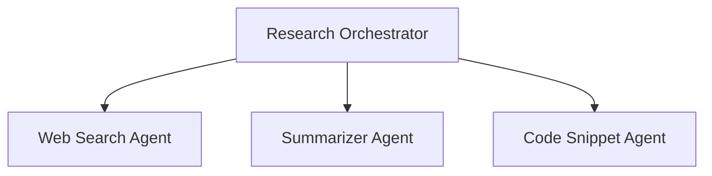

---

# tinyAgent 🤖


```
   __  .__                _____                         __
_/  |_|__| ____ ___.__. /  _  \    ____   ____   _____/  |_
\   __\  |/    <   |  |/  /_\  \  / ___\_/ __ \ /    \   __\
 |  | |  |   |  \___  /    |    \/ /_/  >  ___/|   |  \  |
 |__| |__|___|  / ____\____|__  /\___  / \___  >___|  /__|
              \/\/            \//_____/      \/     \/
```

**Made by (x) [@tunahorse21](https://x.com/tunahorse21) | A product of [alchemiststudios.ai](https://alchemiststudios.ai)**

---

## Heads Up

tinyAgent is in **BETA** until V1. It's working but still evolving! I can't guarantee it's 100% bug-free, but I'm actively improving it whenever I can between my day job and business.  
Found something that could be better? Show off your skills and open an issue with a fix: I’d genuinely appreciate it!

---

## Table of Contents

- [Overview](#overview)
- [Installation](#installation)
  - [Via pip (Recommended)](#via-pip-recommended)
  - [Cloning for Development](#cloning-for-development)
  - [Post-Installation Configuration for Pip Users](#post-installation-configuration-for-pip-users)
- [Example Usage](#example-usage)
- [Tools and the `@tool` Decorator](#tools-and-the-tool-decorator)
  - [Brief Overview of Creating a Tool](#brief-overview-of-creating-a-tool)
  - [Example: Calculator Tool](#example-calculator-tool)
- [tinyAgent Tools Documentation](#tinyagent-tools-documentation)
  - [Tool Categories](#tool-categories)
    - [Template & Examples](#template--examples)
    - [Code & Development Tools](#code--development-tools)
    - [Search & Information Tools](#search--information-tools)
    - [File & Content Tools](#file--content-tools)
    - [System & Integration](#system--integration)
  - [Tool Architecture](#tool-architecture)
    - [Common Features](#common-features)
    - [Integration Points](#integration-points)
  - [Security Considerations](#security-considerations)
  - [Usage](#usage)
  - [Adding New Tools](#adding-new-tools)
  - [Configuration](#configuration)
  - [Creating New Tools](#creating-new-tools)
    - [Step-by-Step Process](#step-by-step-process)
    - [Example Implementation](#example-implementation)
  - [Case Study: CodeAgent Tool Implementation](#case-study-codeagent-tool-implementation)
    - [1. Advanced Structure](#1-advanced-structure)
    - [2. Security Implementation](#2-security-implementation)
    - [3. Context Management](#3-context-management)
    - [4. Error Handling](#4-error-handling)
  - [Tool Development Guidelines](#tool-development-guidelines)
    - [1. Planning Phase](#1-planning-phase)
    - [2. Implementation Phase](#2-implementation-phase)
    - [3. Testing Phase](#3-testing-phase)
    - [4. Integration Phase](#4-integration-phase)
    - [5. Maintenance Phase](#5-maintenance-phase)
- [Philosophy](#philosophy)
  - [Functions as Agents](#functions-as-agents)
  - [Hierarchical Orchestration](#hierarchical-orchestration)
- [Features](#features)
- [Acknowledgments & Inspirations](#acknowledgments--inspirations)
- [Contact](#contact)
- [License](#license)

---

## Overview

tinyAgent is a streamlined framework for building powerful, LLM-powered agents that solve complex tasks through tool execution, orchestration, and dynamic capability creation. Convert any Python function into a useful tool and then into an agent with minimal configuration, which opens up a world of scalable, modular possibilities for your projects.

---

## Installation

### Via pip (Recommended)

Install tinyAgent easily with a single command:

```bash
pip install tiny_agent_os
```

### Cloning for Development

To clone the repository and contribute or experiment directly:

```bash
git clone https://github.com/alchemiststudiosDOTai/tinyAgent.git
cd tinyAgent
```

#### For Linux Users

Run the provided installation script:

```bash
chmod +x install/linuxInstall.sh && ./install/linuxInstall.sh
```

#### Manual Installation

1. **Create a Virtual Environment (Recommended):**

   ```bash
   python3 -m venv .venv
   ```

2. **Activate the Virtual Environment:**

   - On macOS/Linux:
     ```bash
     source .venv/bin/activate
     ```
   - On Windows:
     ```bash
     .\.venv\Scripts\activate
     ```

3. **Install Dependencies:**

   ```bash
   pip install -r requirements.txt
   ```

4. **Set Up Required Configuration Files:**

   Copy the example configuration files:
   
   ```bash
   cp exampleconfig.yml config.yml
   cp .envexample .env
   ```

   Then, edit **config.yml** and **.env** to customize your settings and add your API keys (especially for OpenRouter).

---

## Post-Installation Configuration for Pip Users

After installing via pip, you need to provide your own configuration files. For convenience, download them directly:

### Download the Configuration File (`config.yml`)

Using **wget**:
```bash
wget https://raw.githubusercontent.com/alchemiststudiosDOTai/tinyAgent/v0.65/config.yml
```

Or using **curl**:
```bash
curl -O https://raw.githubusercontent.com/alchemiststudiosDOTai/tinyAgent/v0.65/config.yml
```

### Download the Environment File (`.env`)

Download the example environment file (renaming it to `.env` is required):

Using **wget**:
```bash
wget https://raw.githubusercontent.com/alchemiststudiosDOTai/tinyAgent/v0.65/.envexample -O .env
```

Or using **curl**:
```bash
curl -o .env https://raw.githubusercontent.com/alchemiststudiosDOTai/tinyAgent/v0.65/.envexample
```

> **Note:** Be sure to edit the `.env` file with your actual API keys and any other necessary variables.

---

## Example Usage

The following example demonstrates the heart of tinyAgent: turning a simple function into a fully capable agent.

```python
#!/usr/bin/env python3
"""
Example: Functions as Agents

This example shows how to convert a simple function into a tool with tinyAgent.
"""
from tinyagent.decorators import tool
from tinyagent.factory.agent_factory import AgentFactory

# Define a simple calculator function and turn it into a tool
@tool
def calculate_sum(a: int, b: int) -> int:
    """Calculate the sum of two integers."""
    return a + b

def main():
    """Create a basic agent with the calculator tool."""
    # Create an agent with our tool
    agent = AgentFactory.get_instance().create_agent(tools=[calculate_sum])
    query = "calculate the sum of 5 and 3"
    print(f"Running agent with query: '{query}'")
    result = agent.run(query, expected_type=int)  # Expect an integer result
    print(f"Result: {result}")
    print(f"Result Type: {type(result)}")

if __name__ == "__main__":
    main()
```

---

## Tools and the `@tool` Decorator

tinyAgent’s power comes from **tools**—Python functions that can be transformed into agent-accessible functionality. By simply decorating a function with `@tool`, you make it discoverable and usable by the agent.

### Brief Overview of Creating a Tool

1. **Import the `tool` Decorator**  
   ```python
   from tinyagent.decorators import tool
   ```

2. **Define Your Function**  
   - Provide clear docstrings describing inputs, outputs, and function purpose.

3. **Decorate Your Function**  
   ```python
   @tool
   def my_function(arg1: str, arg2: int) -> bool:
       """Explain what this tool does, the expected input, and output."""
       # Implementation details here
       return True
   ```

4. **Use in an Agent**  
   - Create or obtain an instance of your agent and pass in your newly decorated function as a tool. The agent can now discover and utilize it to accomplish tasks.

### Example: Calculator Tool

Below is an example of turning a basic calculator function (like the `calculate_sum` function) into a tool using the `@tool` decorator:

```python
from tinyagent.decorators import tool
from tinyagent.factory.agent_factory import AgentFactory

@tool
def calculate_sum(a: int, b: int) -> int:
    """
    Calculate the sum of two integers.

    :param a: First integer
    :param b: Second integer
    :return: Sum of a and b
    """
    return a + b

def main():
    # Create an agent with our calculator tool
    agent = AgentFactory.get_instance().create_agent(tools=[calculate_sum])
    # The agent can now interpret instructions like "add X and Y"
    result = agent.run("What is the sum of 10 and 4?", expected_type=int)
    print(result)

if __name__ == "__main__":
    main()
```

Using the `@tool` decorator is all it takes to convert any Python function into a powerful building block for your agent’s capabilities.

---

# tinyAgent Tools Documentation

This section contains more comprehensive documentation on the **core tools** provided by the TinyAgent framework—and how you can create your own.

## Tool Categories

### Template & Examples

#### `boilerplate_tool.py`
- **Purpose**: Example implementation demonstrating a complete tool lifecycle  
- **Features**:
  - Parameter validation  
  - Rate limiting  
  - Error handling  
  - Logging integration  
  - Documentation standards  
  - Example test case  
- **Usage Example**:
  ```python
  from core.tools import boilerplate_tool
  
  result = boilerplate_tool.execute(
      input_data="sample text to process",
      max_items=3
  )
  ```

### Code & Development Tools

#### `codeagent_tool.py`
- **Purpose**: AI-powered Python code generation from natural language
- **Features**:
  - Natural language to Python code conversion
  - Built-in safety checks
  - Code optimization suggestions
  - Documentation generation
  - Error handling patterns
- **Inspiration**: Inspired by smolagents library from Hugging Face
- **Usage Example**:
  ```python
  from core.tools import codeagent_tool
  
  result = codeagent_tool.execute(
      task="Create a function that calculates Fibonacci sequence",
      context_memory="Previous calculations...",
      mode="advanced",
      available_tools=["web_search", "summarize_text"]
  )
  ```

#### `anon_coder.py`
- **Purpose**: Safe Python code execution environment
- **Features**:
  - Secure code validation
  - Timeout protection
  - Restricted imports
  - Detailed error reporting
  - Configuration-based security settings

#### `aider.py`
- **Purpose**: AI coding assistant integration
- **Features**:
  - Code generation
  - Code modification
  - AI-assisted development

#### `llm_serializer.py`
- **Purpose**: LLM data serialization and handling
- **Features**:
  - Data format conversion
  - LLM response processing
  - Structured data handling

### Search & Information Tools

#### `brave_search.py`
- **Purpose**: Brave search engine integration
- **Features**:
  - Web search capabilities
  - Result processing
  - Query optimization

#### `duckduckgo_search.py`
- **Purpose**: DuckDuckGo search integration
- **Features**:
  - Privacy-focused search
  - Result formatting
  - Query handling

#### `enhanced_deepsearch.py`
- **Purpose**: Advanced search capabilities
- **Features**:
  - Deep content analysis
  - Advanced filtering
  - Result ranking

#### `os_deepsearch.py`
- **Purpose**: Operating system deep search
- **Features**:
  - File system search
  - Content indexing
  - Pattern matching

### File & Content Tools

#### `file_manipulator.py`
- **Purpose**: File operations and management
- **Features**:
  - File creation/modification
  - Directory operations
  - File system utilities

#### `ripgrep.py`
- **Purpose**: Fast text search
- **Features**:
  - Regular expression search
  - Fast pattern matching
  - Result highlighting

#### `content_processor.py`
- **Purpose**: Content processing and analysis
- **Features**:
  - Text processing
  - Content extraction
  - Format conversion

#### `custom_text_browser.py`
- **Purpose**: Text browsing capabilities
- **Features**:
  - Text navigation
  - Content display
  - Interactive browsing

### System & Integration

#### `external.py`
- **Purpose**: External tool loading and management
- **Features**:
  - Dynamic tool loading
  - External tool integration
  - Tool lifecycle management

---

## Tool Architecture

### Common Features
- **Standardized Tool Class Interface**: All tools extend a common base class or structure.  
- **Parameter Typing Support**: Tools specify their expected parameters and return types.  
- **Comprehensive Error Handling**: Tools raise specific exceptions (`ToolError`) to simplify debugging.  
- **Security Measures**: Tools can implement their own resource limits, input validation, or sandboxing.  
- **Logging Integration**: Tools log key actions and errors.

### Integration Points
- **Dynamic Tool Loading**: Tools can be discovered and loaded at runtime.  
- **Configuration Support**: Tools read from environment variables and config files.  
- **Parameter Types**: Tools define required parameters with typed fields.  
- **Common Error Handling**: Errors from different tools can be consistently caught and handled.  
- **Logging System Integration**: Tools use a shared logging mechanism for easy debugging.

---

## Security Considerations

All tools implement security measures including (but not limited to):
- **Input Validation**: Tools should sanitize or validate inputs.  
- **Resource Limits**: Tools that perform network or file operations may enforce timeouts or quotas.  
- **Access Controls**: Tools that operate on the system or external services can require specific permissions.  
- **Safe Execution Environments**: Tools that execute code (e.g., `anon_coder`) are sandboxed.  
- **Error Containment**: Tools handle exceptions gracefully, preventing global crashes.  

---

## Usage

Tools can be imported and used as follows:

```python
from core.tools import anon_coder_tool, file_manipulator_tool

# Example usage
result = anon_coder_tool.execute(code="print('Hello, World!')")
```

---

## Adding New Tools

To add a new tool:

1. **Create a new Python file** in `core/tools/`.  
2. **Implement** the tool class (or use the `@tool` decorator pattern, depending on your design).  
3. **Add security measures** and error handling.  
4. **Register the tool** in `core/tools/__init__.py`.  
5. **Update** this documentation or your project’s README.  

---

## Configuration

Tools can be configured through the framework’s configuration system. Each tool may have its own config options—check individual tool docstrings for specifics.

---

## Creating New Tools

### Step-by-Step Process

1. **Tool Structure**  
   ```python
   from typing import Dict, Any, Optional
   from ..tool import Tool, ParamType
   from ..logging import get_logger
   from ..exceptions import ToolError
   
   class NewTool(Tool):
       def __init__(self):
           super().__init__(
               name="tool_name",
               description="Detailed tool description",
               parameters={
                   "param1": ParamType.STRING,
                   "param2": ParamType.INTEGER
               }
           )
   ```

2. **Required Components**  
   - A tool class inheriting from `Tool` (or a function with the `@tool` decorator).  
   - Proper parameter typing (or docstrings if using decorators).  
   - Error handling.  
   - Logging integration.  
   - Security measures.  
   - Documentation.

3. **Best Practices**  
   - Use type hints or annotated parameters.  
   - Implement comprehensive error handling.  
   - Add detailed logging for debugging.  
   - Include docstrings that explain usage.  
   - Follow security guidelines.  
   - Write unit tests.  

4. **Integration Steps**  
   - Create the tool file under `core/tools/`.  
   - Implement the tool’s logic.  
   - Add an import reference in `__init__.py`.  
   - Update your README or documentation.  
   - Add tests.  
   - Add configuration options if needed.

5. **Security Checklist**  
   - Input validation.  
   - Resource limits.  
   - Access controls.  
   - Safe execution.  
   - Error containment.  
   - Logging.  
   - Configuration validation.

6. **Documentation Requirements**  
   - Purpose and Features.  
   - Parameters and Return Values.  
   - Examples.  
   - Security considerations.  
   - Configuration options.

### Example Implementation

```python
class ExampleTool(Tool):
    def __init__(self):
        super().__init__(
            name="example",
            description="Example tool description",
            parameters={
                "input": ParamType.STRING,
                "options": ParamType.DICT
            }
        )
    
    def execute(self, input: str, options: Dict[str, Any]) -> Dict[str, Any]:
        try:
            # Your implementation here
            return {"result": "success"}
        except Exception as e:
            logger.error(f"Error: {str(e)}")
            raise ToolError(f"Failed: {str(e)}")
```

---

## Case Study: CodeAgent Tool Implementation

The `codeagent_tool.py` demonstrates a more advanced tool with several key features:

### 1. Advanced Structure

```python
# Use dataclasses for context management
from dataclasses import dataclass
from enum import Enum
from typing import List

class CodeGenerationMode(Enum):
    BASIC = "basic"
    ADVANCED = "advanced"
    RESEARCH = "research"

@dataclass
class CodeGenerationContext:
    memory: str = ""
    available_tools: List[str] = None
    mode: CodeGenerationMode = CodeGenerationMode.BASIC
    max_iterations: int = 3
    timeout: int = 15
```

### 2. Security Implementation

```python
import re
import logging

logger = logging.getLogger(__name__)

def validate_generated_code(code: str) -> bool:
    dangerous_patterns = [
        r'exec\s*\(',
        r'eval\s*\(',
        r'os\.',
        r'sys\.',
        r'subprocess\.',
        r'__import__\s*\('
    ]
    for pattern in dangerous_patterns:
        if re.search(pattern, code):
            logger.warning(f"Dangerous operation detected: {pattern}")
            return False
    return True
```

### 3. Context Management

```python
def generate_system_prompt(context: CodeGenerationContext, task: str) -> str:
    tools_description = "\n".join([
        f"- {tool}() -> returns {tool} results" 
        for tool in (context.available_tools or [])
    ])
    return f"""
    You are a code generation agent.
    Task: {task}
    Tools available:
    {tools_description}
    """
```

### 4. Error Handling

```python
import traceback

def execute_code_generation(task: str, context: CodeGenerationContext):
    try:
        # Hypothetical code generation logic
        generated_code = some_ai_model_generate(task, context)
        if not validate_generated_code(generated_code):
            raise ValueError("Unsafe code detected.")
        execution_output = safe_execute(generated_code, context)
        return {
            "success": True,
            "generated_code": generated_code,
            "execution_result": execution_output,
            "error": None
        }
    except Exception as e:
        logger.error(f"Error: {str(e)}\n{traceback.format_exc()}")
        return {
            "success": False,
            "error": str(e),
            "generated_code": "",
            "execution_result": ""
        }
```

---

## Tool Development Guidelines

### 1. Planning Phase
- Define your tool’s purpose and scope.  
- Identify required parameters.  
- Outline security measures.  
- Decide on error handling approach.  
- Consider integration with existing tools.

### 2. Implementation Phase
- Write the core functionality.  
- Add security measures (e.g., safe execution, input validation).  
- Implement detailed error handling.  
- Log key steps for debugging.  
- Write docstrings and inline documentation.

### 3. Testing Phase
- Write unit tests for the tool’s logic.  
- Test integration with other tools or the main agent.  
- Check security boundaries.  
- Evaluate performance under typical and edge conditions.  

### 4. Integration Phase
- Register your tool in `__init__.py` or use the `@tool` decorator.  
- Update relevant configuration files.  
- Add usage examples in your main application or docs.  
- Monitor logs for any issues after deployment.

### 5. Maintenance Phase
- Gather feedback from users or other developers.  
- Update docs and tests as the tool evolves.  
- Optimize performance or memory usage if needed.  
- Fix bugs and ensure security patches are applied.

---

## Philosophy

tinyAgent is built on two core ideas:

### Functions as Agents

Any Python function can be transformed into a tool—and then seamlessly integrated into an agent. This approach makes extending and innovating simple. Just tag your functions with the `@tool` decorator and let tinyAgent do the rest.




### Hierarchical Orchestration

For more complex tasks, tinyAgent allows multiple agents to work together. A master orchestrator can delegate work to specialized agents—such as web search, summarization, or code snippet agents—to solve problems step-by-step.



---

## Features

- **Modular Design:** Easily convert any function into a tool using the `@tool` decorator.  
- **Flexible Agent Options:** Leverage simple orchestrators, fine-tuned control with AgentFactory, or dynamic agent creation.  
- **Centralized Setup:** Configure the framework using environment variables and configuration files.  
- **Robust Error Handling:** Benefit from improved debugging with custom exceptions (e.g., `ToolError`).  
- **Versatile Interaction:** Choose precise tool execution via `agent.execute_tool()` or broader command execution with `agent.run()`.  
- **Structured Output:** Optionally enforce JSON formatting for consistent, structured responses.

---

## Acknowledgments & Inspirations

A big thank you goes out to everyone who has inspired and contributed to tinyAgent. 
- **My Wife**  
- [HuggingFace SmoLAgents](https://github.com/huggingface/smolagents)  
- [Aider-AI](https://github.com/Aider-AI/aider)  
- [Kyon-eth](https://github.com/kyon-eth)  
- [RA.Aid](https://github.com/ai-christianson/RA.Aid)

---

## Contact

For questions, suggestions, or business inquiries:
- **Email**: [info@alchemiststudios.ai](mailto:info@alchemiststudios.ai)  
- **X**: [@tunahorse21](https://x.com/tunahorse21)  
- **Website**: [alchemiststudios.ai](https://alchemiststudios.ai)

---

## License

**Business Source License 1.1 (BSL)**  
This project is licensed under the Business Source License 1.1. It is **free for individuals and small businesses** (with annual revenues under $1M).  
For commercial use by larger businesses, an enterprise license is required.  
For licensing or usage inquiries, please contact: [info@alchemiststudios.ai](mailto:info@alchemiststudios.ai).

---
