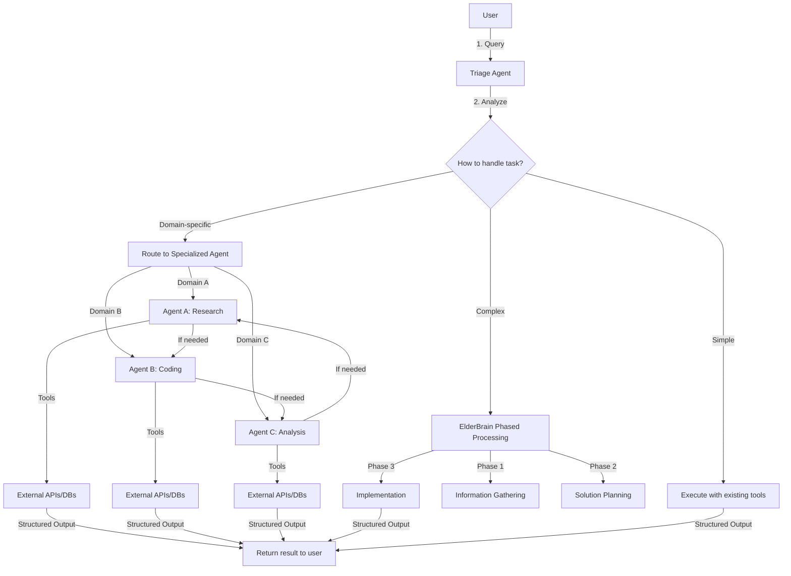

# tinyAgent 🤖

A streamlined framework for building powerful LLM-powered agents that can solve complex tasks through tool execution, orchestration, and dynamic capability creation.

**Made by (x) @tunahorse21 | A product of alchemiststudios.ai**

> **IMPORTANT**: tinyAgent is in EARLY BETA until V1. Use common sense when working with this tool.  
> NOT RESPONSIBLE FOR ANY ISSUES that may arise from its use.
> I made this becuase I wanted to, I work fulltime + business, bugs will be fixed asap but expect some issues until V1
> Nerds, please don't get mad, instead show me how "cracked" you are and open an issue with a fix ! 


```
   __  .__                _____                         __   
_/  |_|__| ____ ___.__. /  _  \    ____   ____   _____/  |_ 
\   __\  |/    <   |  |/  /_\  \  / ___\_/ __ \ /    \   __\
 |  | |  |   |  \___  /    |    \/ /_/  >  ___/|   |  \  |  
 |__| |__|___|  / ____\____|__  /\___  / \___  >___|  /__|  
              \/\/            \//_____/      \/     \/      
 tinyAgent: AGI made simple
```

## Overview

tinyAgent takes a unique approach to AI agents by treating functions as first-class citizens that can be easily converted into powerful agent tools. With a hierarchical orchestration system inspired by human organizations, tinyAgent can dynamically create specialized agents to handle complex tasks while maintaining a balance between security and capability.

Unlike many agent frameworks that rely on complex chains or graphs to manage workflow, tinyAgent uses a more natural approach: specialized agents that can be dynamically created and composed as needed, with a central "triage" agent that routes tasks to the right specialist.

## Key Features

- **Functions as Agents**: Turn any Python function into an agent tool with minimal code
- **Hierarchical Orchestration**: A triage system that routes tasks to specialized agents
- **Dynamic Capability Creation**: Create new specialized agents on-demand for specific tasks
- **ElderBrain Processing**: Three-phase approach (Research → Planning → Implementation) for complex tasks
- **Configurable Security**: Balance security with flexibility through configuration
- **MCP Integration**: Leverage Model Context Protocol servers for powerful tool extensibility
- **Built-in Tools**: Includes tools for code execution, web search, file search, and more
- **External Tool Support**: Use tools written in any language through a simple JSON interface

## Architecture

tinyAgent follows a hierarchical architecture with infinite handoffs between specialized agents:



### Key Architectural Components:

1. **Triage Agent**:
   - Initial contact point for all user queries
   - Analyzes queries to determine the most appropriate specialized agent
   - Routes tasks based on topic, keywords, or required capabilities
   - Handles simple queries directly when no specialization is needed

2. **Specialized Agents**:
   - Domain-specific expertise (research, coding, analysis, etc.)
   - Access to domain-relevant tools and external resources
   - Can re-route queries to other specialists as needed (infinite handoff)
   - Output results in structured, consistent formats

3. **Infinite Handoff System**:
   - Allows conversations to flow between specialists without limit
   - Routes tasks dynamically as requirements evolve
   - Maintains context throughout the handoff chain

4. **ElderBrain Processing**:
   - Three-phase approach for complex tasks:
     1. **Information Gathering**: Researches and collects relevant context
     2. **Solution Planning**: Creates a detailed step-by-step action plan
     3. **Execution**: Methodically implements the solution

5. **Structured Output System**:
   - Consistent output formats (JSON, Markdown, etc.)
   - Makes results easily parsable by other systems and agents
   - Ensures reliable data exchange between components

## Getting Started

### Installation

```bash
# Clone the repository
git clone https://github.com/alchemiststudiosDOTai/tinyAgent.git

cd tinyagent

# Option 1: For Linux users, run the installation script
chmod +x install/linuxInstall.sh && ./install/linuxInstall.sh

# Option 2: Manual installation
# Create a virtual environment (recommended)
python3 -m venv .venv

# Activate the virtual environment
# On macOS/Linux
source .venv/bin/activate
# On Windows
.\.venv\Scripts\activate

# Install dependencies
# Option 1: Using UV (recommended - see INSTALL.md for details)
# Option 2: Using pip
pip install -r requirements.txt

# Set up required configuration files
# 1. Environment variables
cp .envexample .env
# Edit .env to add your API keys (especially OpenRouter)

# 2. Configuration file
cp exampleconfig.yml config.yml
# Edit config.yml to customize your settings
```

### Required API Keys

You need to obtain API keys for the following services:

1. **OpenRouter API**: Required for accessing various LLM models
   - Visit [https://openrouter.ai/](https://openrouter.ai/) to create an account and get your API key, you can also use any openai like api
   - Add this key to your `.env` file as `OPENROUTER_API_KEY=your_key_here`
2. **Brave Search API**: Required for MCP Brave search functionality
   - Run `npm install` AND `npm run build` in the MCP directory
   - Get your API key from [Brave Search](https://brave.com/search/api/)
   - Add this key to your `.env` file as `BRAVE=your_brave_key_here`

For detailed installation instructions including UV support, please refer to the [INSTALL.md](INSTALL.md) file.

### Important Note on Tools

Some integrated tools in tinyAgent require special attention:

- **Aider**: The aider tool is highly configurable and powerful. We strongly recommend taking time to learn its capabilities thoroughly before using it in your projects. Visit [aider.chat](https://aider.chat/) for comprehensive documentation.

### Simple Example

```python
from tinyagent import Agent, tool

# Create a tool with just a decorator
@tool
def calculate_sum(a: int, b: int) -> int:
    """Calculate the sum of two numbers."""
    return a + b

# Create an agent with the tool
agent = Agent(tools=[calculate_sum])

# Run a query
result = agent.run("Calculate 5 plus 3")
print(result)  # Output: 8
```

### Using the CLI

tinyAgent includes a powerful CLI interface:

```bash
# Start the CLI
python main.py

# Execute a task
> calculate the sum of 5 and 3
```

## Configuration

tinyAgent is highly configurable through the `config.yml` file:

```yaml
# Model configuration
model:
  default: "deepseek/deepseek-chat"

# Security configuration for code execution
code_execution:
  allow_dangerous_operations: false
  allowed_operations:
    file_operations: false
    os_operations: false
    imports: []

# Dynamic agent configuration
dynamic_agents:
  allow_new_tools_by_default: false
  prioritize_existing_tools: true
  max_agents: 10
  
# ElderBrain configuration
elder_brain:
  default_enabled: true  # Use phased approach by default
  verbosity: 2           # Level of detailed logging
  model: null            # Use system default model
```

## Documentation

tinyAgent includes extensive documentation within the codebase:

- **Core Architecture**: `/core/docs/architecture.md`
- **Tool Framework**: `/core/docs/tools.md`
- **Orchestration**: `/documentiation/orchestration.md`
- **MCP Integration**: `/core/docs/mcp.md`
- **Philosophy**: `/documentiation/agentsarefunction.md`

The documentation is structured to provide both high-level overviews and detailed technical specifications, making it easy to understand the system from multiple perspectives.

## Philosophy

tinyAgent is built on several key philosophical principles:

### 1. Functions as Agents

At its core, tinyAgent treats functions as first-class agents. Any function can be transformed into an agent tool with minimal overhead, emphasizing:
- **Simplicity**: Converting a Python function into an agent requires minimal boilerplate
- **Composability**: Individual function-agents can be combined to create more complex capabilities
- **Modularity**: Each function encapsulates a specific capability with clear inputs and outputs

### 2. Hierarchical Orchestra of Specialized Agents

The architecture leverages a hierarchical approach to problem-solving:
- The **Triage Agent** serves as the conductor, analyzing tasks and routing them appropriately
- **Specialized Agents** focus on specific domains or capabilities (research, coding, data analysis)
- **Infinite Handoffs** allow conversations to flow between agents as tasks evolve
- **Structured Output** ensures consistent, parsable results across all agents
- **Tools** are the atomic units of functionality that agents use to accomplish tasks

### 3. Dynamic Capability Creation

tinyAgent embraces the philosophy that capabilities should be created on-demand:
- New specialized agents can be created dynamically when needed
- The system can assess whether existing tools are sufficient or if new ones are required
- This follows a "progressive enhancement" model where capabilities evolve based on task requirements

### 4. Security with Flexibility

The system balances security concerns with practical flexibility:
- Default restrictions on potentially harmful operations (like file access)
- Configuration-based controls allow adjusting security based on trust and requirements
- This demonstrates a "secure by default, flexible by choice" philosophy

### 5. Structured Problem Solving

The ElderBrain's three-phase approach reflects human problem-solving patterns:
- **Research First**: Gathering comprehensive information before making decisions
- **Plan Before Action**: Creating a detailed strategy based on gathered intelligence
- **Methodical Execution**: Implementing solutions in a structured, step-by-step manner
- This mimics how expert humans tackle complex problems, ensuring thorough and considered results

## Roadmap of Improvements

tinyAgent is actively evolving with several planned improvements:

### Near-term (0-3 months)
- ✅ **Configurable Security**: Enhanced security options for code execution (recently implemented)
- 🔄 **Memory and Context Management**: Improved handling of conversation history and context
- 🔄 **Multi-modal Support**: Better handling of images, audio, and other non-text inputs
- 🔄 **Tool Chaining Improvements**: More robust tool chaining capabilities

### Mid-term (3-6 months)
- 📝 **Advanced Orchestration Patterns**: More sophisticated task routing and agent collaboration
- 📝 **Expanded Model Provider Support**: Integration with more LLM providers and models
- 📝 **Performance Optimization**: Caching, parallelization, and other performance improvements
- 📝 **Test Framework**: Comprehensive test suite for agent behavior validation

### Long-term (6+ months)
- 🔮 **Web Interface/Dashboard**: Graphical interface for monitoring and managing agents
- 🔮 **Tool Marketplace**: Community-contributed tools ecosystem
- 🔮 **Multi-agent Collaboration**: Enhanced collaboration between specialized agents
- 🔮 **Learning and Adaptation**: Agents that improve over time based on usage patterns

### Documentation Improvements
- 📚 **Interactive Examples**: More comprehensive and interactive examples
- 📚 **Video Tutorials**: Visual guides to using and extending tinyAgent
- 📚 **API Reference**: Complete API documentation for all components
- 📚 **Best Practices Guide**: Detailed guidelines for developing with tinyAgent

## Contributing

Contributions to tinyAgent are welcome! Whether you're fixing bugs, adding features, or improving documentation, your help is appreciated.

## Acknowledgments & Inspo
We'd like to thank the creators of these amazing projects that inspired TinyAgent:
- My Wife
- [HuggingFace SmoLAgents](https://github.com/huggingface/smolagents)
- [Aider-AI](https://github.com/Aider-AI/aider)
- [Kyon-eth](https://github.com/kyon-eth)
- [RA.Aid](https://github.com/ai-christianson/RA.Aid)

**Important Note on Tools**: 

The aider tool integrated in TinyAgent is extremely powerful but requires proper understanding to use effectively. It's highly configurable with many advanced features that can dramatically enhance productivity when used correctly.

**⚠️ We strongly recommend thoroughly learning aider before using it in any serious projects.** 

Invest time in studying the documentation at https://aider.chat/ to understand its capabilities, configuration options, and best practices. This investment will pay off significantly in your development workflow.


## License

tinyAgent is licensed under the Sustainable Business License:

**Sustainable Business License (SBL) v1.0**

This software is provided under the Sustainable Business License, which balances open source values with sustainable commercial development:

1. **Free for Personal and Academic Use**: You may freely use, modify, and distribute this software for personal, educational, research, and academic purposes.

2. **Commercial Use**: Commercial use of this software requires a paid license from alchemiststudios.ai, except for evaluation purposes or small businesses with annual revenue under $1M.

3. **Contribution License**: All contributions to this project are licensed under the same terms, allowing the project maintainers to relicense contributions as needed for project sustainability.

4. **Derivative Works**: You may create and distribute derivative works under the same license terms.

5. **No Warranty**: This software is provided "AS IS" with NO WARRANTY, either expressed or implied.

For complete license details or to acquire a commercial license, please contact: licensing@alchemiststudios.ai
