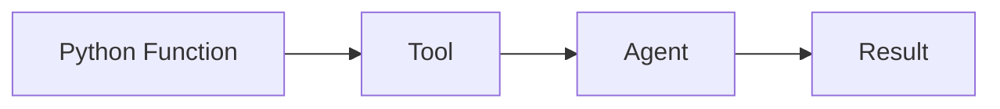
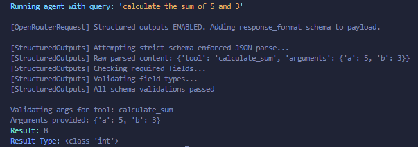
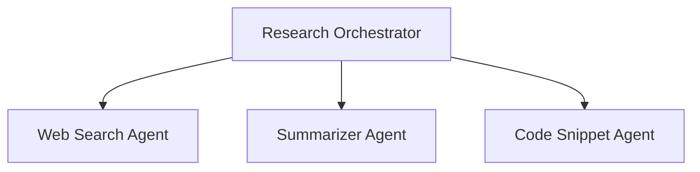

# tinyAgent 🤖


```
   __  .__                _____                         __
_/  |_|__| ____ ___.__. /  _  \    ____   ____   _____/  |_
\   __\  |/    <   |  |/  /_\  \  / ___\_/ __ \ /    \   __\
 |  | |  |   |  \___  /    |    \/ /_/  >  ___/|   |  \  |
 |__| |__|___|  / ____\____|__  /\___  / \___  >___|  /__|
              \/\/            \//_____/      \/     \/
```

**Made by (x) [@tunahorse21](https://github.com/tunahorse21) | A product of [alchemiststudios.ai](https://alchemiststudios.ai)**

---

## Heads Up

tinyAgent is in **BETA** until V1. It's working but still evolving! I can't guarantee it's 100% bug-free, but I'm actively improving it whenever I can between my day job and business.  
Found something that could be better? Show off your skills and open an issue with a fix: I’d genuinely appreciate it!

---

## Table of Contents

- [Overview](#overview)
- [Installation](#installation)
  - [Via pip (Recommended)](#via-pip-recommended)
  - [Cloning for Development](#cloning-for-development)
  - [Post-Installation Configuration for Pip Users](#post-installation-configuration-for-pip-users)
- [Example Usage](#example-usage)
- [Philosophy](#philosophy)
  - [Functions as Agents](#functions-as-agents)
  - [Hierarchical Orchestration](#hierarchical-orchestration)
- [Features](#features)
- [Acknowledgments & Inspirations](#acknowledgments--inspirations)
- [Contact](#contact)

---

## Overview

tinyAgent is a streamlined framework for building powerful, LLM-powered agents that solve complex tasks through tool execution, orchestration, and dynamic capability creation. Convert any Python function into a useful tool and then into an agent with minimal configuration, which opens up a world of scalable, modular possibilities for your projects.

---

## Installation

### Via pip (Recommended)

Install tinyAgent easily with a single command:

```bash
pip install tiny_agent_os
```

### Cloning for Development

To clone the repository and contribute or experiment directly:

```bash
git clone https://github.com/alchemiststudiosDOTai/tinyAgent.git
cd tinyAgent
```

#### For Linux Users

Run the provided installation script:

```bash
chmod +x install/linuxInstall.sh && ./install/linuxInstall.sh
```

#### Manual Installation

1. **Create a Virtual Environment (Recommended):**

   ```bash
   python3 -m venv .venv
   ```

2. **Activate the Virtual Environment:**

   - On macOS/Linux:
     ```bash
     source .venv/bin/activate
     ```
   - On Windows:
     ```bash
     .\.venv\Scripts\activate
     ```

3. **Install Dependencies:**

   ```bash
   pip install -r requirements.txt
   ```

4. **Set Up Required Configuration Files:**

   Copy the example configuration files:
   
   ```bash
   cp exampleconfig.yml config.yml
   cp .envexample .env
   ```

   Then, edit **config.yml** and **.env** to customize your settings and add your API keys (especially for OpenRouter).

---

## Post Installation Configuration for Pip Users

After installing via pip, you need to provide your own configuration files. For convenience, download them directly:

### Download the Configuration File (`config.yml`)

Using **wget**:
```bash
wget https://raw.githubusercontent.com/alchemiststudiosDOTai/tinyAgent/v0.65/config.yml
```

Or using **curl**:
```bash
curl -O https://raw.githubusercontent.com/alchemiststudiosDOTai/tinyAgent/v0.65/config.yml
```

### Download the Environment File (`.env`)

Download the example environment file (renaming it to `.env` is required):

Using **wget**:
```bash
wget https://raw.githubusercontent.com/alchemiststudiosDOTai/tinyAgent/v0.65/.envexample -O .env
```

Or using **curl**:
```bash
curl -o .env https://raw.githubusercontent.com/alchemiststudiosDOTai/tinyAgent/v0.65/.envexample
```

> **Note:** Be sure to edit the `.env` file with your actual API keys and any other necessary variables.

---

## Example Usage

The following example demonstrates the heart of tinyAgent: turning a simple function into a fully capable agent.

```python
#!/usr/bin/env python3
"""
Example: Functions as Agents

This example shows how to convert a simple function into a tool with tinyAgent.
"""
from tinyagent.decorators import tool
from tinyagent.factory.agent_factory import AgentFactory

# Define a simple calculator function and turn it into a tool
@tool
def calculate_sum(a: int, b: int) -> int:
    """Calculate the sum of two integers."""
    return a + b

def main():
    """Create a basic agent with the calculator tool."""
    # Create an agent with our tool
    agent = AgentFactory.get_instance().create_agent(tools=[calculate_sum])
    query = "calculate the sum of 5 and 3"
    print(f"Running agent with query: '{query}'")
    result = agent.run(query, expected_type=int)  # Expect an integer result
    print(f"Result: {result}")
    print(f"Result Type: {type(result)}")

if __name__ == "__main__":
    main()
```

---

## Philosophy

tinyAgent is built on two core ideas:

### Functions as Agents

Any Python function can be transformed into a tool—and then seamlessly integrated into an agent. This approach makes extending and innovating simple. Just tag your functions with the `@tool` decorator and let tinyAgent do the rest.





### Hierarchical Orchestration

For more complex tasks, tinyAgent allows multiple agents to work together. A master orchestrator can delegate work to specialized agents—such as web search, summarization, or code snippet agents—to solve problems step-by-step.



---

## Features

- **Modular Design:** Easily convert any function into a tool using the `@tool` decorator.
- **Flexible Agent Options:** Leverage simple orchestrators, fine-tuned control with AgentFactory, or dynamic agent creation.
- **Centralized Setup:** Configure the framework using environment variables and configuration files.
- **Robust Error Handling:** Benefit from improved debugging with custom exceptions (e.g., `ToolError`).
- **Versatile Interaction:** Choose precise tool execution via `agent.execute_tool()` or broader command execution with `agent.run()`.
- **Structured Output:** Optionally enforce JSON formatting for consistent, structured responses.

---

## Acknowledgments & Inspirations

A big thank you goes out to everyone who has inspired and contributed to tinyAgent. 
- **My Wife** 
- [HuggingFace SmoLAgents](https://github.com/huggingface/smolagents)
- [Aider-AI](https://github.com/Aider-AI/aider)
- [Kyon-eth](https://github.com/kyon-eth)
- [RA.Aid](https://github.com/ai-christianson/RA.Aid)


---

## License

**Business Source License 1.1 (BSL)**  
This project is licensed under the Business Source License 1.1. It is **free for individuals and small businesses** (with annual revenues under $1M).  
For commercial use by larger businesses, an enterprise license is required.  
For licensing or usage inquiries, please contact: [info@alchemiststudios.ai](mailto:info@alchemiststudios.ai).

---
