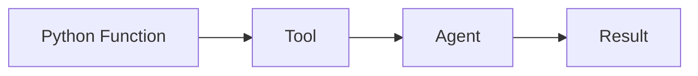
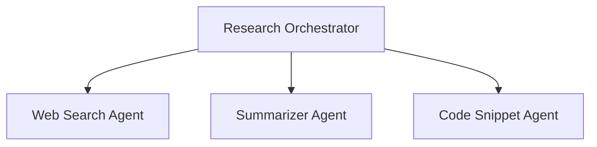
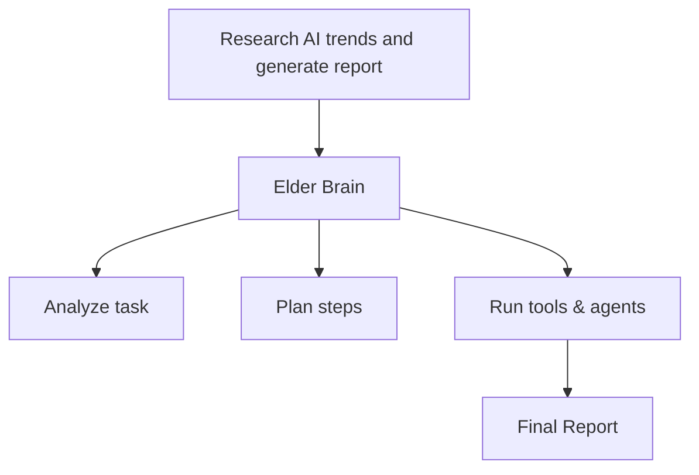

# tinyAgent 🤖

A streamlined framework for building powerful LLM-powered agents that can solve complex tasks through tool execution, orchestration, and dynamic capability creation.

**Made by (x) @tunahorse21 | A product of alchemiststudios.ai**

> **IMPORTANT**: tinyAgent is in EARLY BETA until V1. Use common sense when working with this tool.  
> NOT RESPONSIBLE FOR ANY ISSUES that may arise from its use.
> I made this becuase I wanted to, I work fulltime + business, bugs will be fixed asap but expect some issues until V1
> Nerds, please don't get mad, instead show me how "cracked" you are and open an issue with a fix !


```
   __  .__                _____                         __
_/  |_|__| ____ ___.__. /  _  \    ____   ____   _____/  |_
\   __\  |/    <   |  |/  /_\  \  / ___\_/ __ \ /    \   __\
 |  | |  |   |  \___  /    |    \/ /_/  >  ___/|   |  \  |
 |__| |__|___|  / ____\____|__  /\___  / \___  >___|  /__|
              \/\/            \//_____/      \/     \/
```

### Installation

```bash
# Clone the repository
git clone https://github.com/alchemiststudiosDOTai/tinyAgent.git

cd tinyagent

# Option 1: For Linux users, run the installation script
chmod +x install/linuxInstall.sh && ./install/linuxInstall.sh

# Option 2: Manual installation
# Create a virtual environment (recommended)
python3 -m venv .venv

# Activate the virtual environment
# On macOS/Linux
source .venv/bin/activate
# On Windows
.\.venv\Scripts\activate

# Install dependencies
# Option 1: Using UV (recommended - see INSTALL.md for details)
# Option 2: Using pip
pip install -r requirements.txt

# Set up required configuration files
# 1. Environment variables
cp .envexample .env
# Edit .env to add your API keys (especially OpenRouter)

# 2. Configuration file
cp exampleconfig.yml config.yml
# Edit config.yml to customize your settings
```

---

## Philosophy

1. **Functions as Agents**
   - You can turn **any function** into a **tool** or **agent**.
   - This makes it easy to add new capabilities.



2. **Hierarchical Orchestration**
   - You can **combine many agents** together.
   - A **top-level agent** or **orchestrator** can **delegate tasks** to **specialized agents**.
   - This helps solve **complex problems** by breaking them into parts.




```python
# Define a simple calculator function and turn it into a tool
@tool
def calculate_sum(a: int, b: int) -> int:
    """Calculate the sum of two integers."""
    return a + b

def main():
    """Create a basic agent with a calculator tool."""
    # One-liner: create agent with our tool directly
    agent = AgentFactory.get_instance().create_agent(tools=[calculate_sum])
    # Run the agent with a query
    query = "calculate the sum of 5 and 3"
    print(f"Running agent with query: '{query}'")
    # you can also specify the expected type of the result
    result = agent.run(query, expected_type=int)
    print(f"Result: {result}")
    print(f"Result Type: {type(result)}")
```

3. **Elder Brain (Experimental)**
   - You give it **one big prompt**.
   - It **analyzes** the task, **plans** steps, **runs tools/agents**, and **combines results**.
   - Acts like a **project manager** for complex workflows.
   - **Highly experimental** and still in development.



---

## Features

1. **Modular Design**

   - Tools are defined with `@tool` and easily integrated or swapped.

2. **Flexible Agent Options**

   - **Orchestrator**: Simple task execution.
   - **AgentFactory**: Fine-tuned control.
   - **DynamicAgentFactory**: Dynamic agent creation.

3. **Centralized Setup**

   - Factory pattern streamlines configuration and logging.

4. **Robust Error Handling**

   - Custom exceptions (e.g., `ToolError`) improve debugging.

5. **Clean Code Structure**

   - Agents handle logic; tools handle execution.

6. **Versatile Interaction**

   - Use `agent.execute_tool()` for precision or `agent.run()` for broader tasks.

7. **Structured Output**
   - Enforce JSON structure on LLM responses for consistent parsing
   - Enable with `output.structured: true` in config.yml
   - Compatible with OpenRouter's JSON schema validation

---

## Benefits

1. **Modular Design**

   - Tools are defined with `@tool` and easily integrated or swapped.

2. **Flexible Agent Options**

   - **Orchestrator**: Simple task execution.
   - **AgentFactory**: Fine-tuned control.
   - **DynamicAgentFactory**: Dynamic agent creation.

3. **Centralized Setup**

   - Factory pattern streamlines configuration and logging.

4. **Robust Error Handling**

   - Custom exceptions (e.g., `ToolError`) improve debugging.

5. **Clean Code Structure**

   - Agents handle logic; tools handle execution.

6. **Versatile Interaction**
   - Use `agent.execute_tool()` for precision or `agent.run()` for broader tasks.

---

---

## Acknowledgments & Inspo

We'd like to thank the creators of these amazing projects that inspired TinyAgent:

- My Wife
- [HuggingFace SmoLAgents](https://github.com/huggingface/smolagents)
- [Aider-AI](https://github.com/Aider-AI/aider)
- [Kyon-eth](https://github.com/kyon-eth)
- [RA.Aid](https://github.com/ai-christianson/RA.Aid)

---

## Contributing

## Contributions to tinyAgent are welcome! Whether you're fixing bugs, adding features, or improving documentation, your help is appreciated.

## Key Takeaways

- **tinyAgent** is perfect for scalable AI projects needing structured agent and tool management.
- It offers **extensibility**, **error handling**, and **logging**, but may be overkill for simple tasks.

_Important Note on Tools_:

The aider tool integrated in TinyAgent is extremely powerful but requires proper understanding to use effectively. It's highly configurable with many advanced features that can dramatically enhance productivity when used correctly.

**⚠️ We strongly recommend thoroughly learning aider before using it in any serious projects.**

Invest time in studying the documentation at https://aider.chat/ to understand its capabilities, configuration options, and best practices. This investment will pay off significantly in your development workflow.
