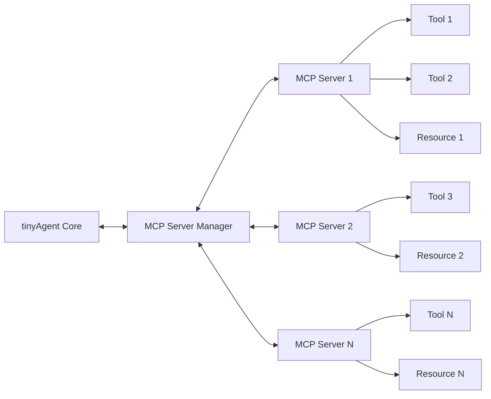

# Model Context Protocol (MCP) Integration

This document provides a comprehensive guide to the Model Context Protocol (MCP) integration in tinyAgent, including its architecture, usage, and extension capabilities.

## What is MCP?

Model Context Protocol (MCP) is a standard for communication between language models and external systems. It allows tinyAgent to extend its capabilities by connecting to MCP servers that provide specialized tools and resources.

MCP enables:

- **Tool Extension**: Add new capabilities to tinyAgent without modifying its core code
- **Resource Access**: Access external data sources, APIs, and services
- **Cross-Language Support**: Use tools written in languages other than Python
- **Distributed Architecture**: Run tools on different machines or in different environments

## MCP Architecture in tinyAgent

tinyAgent's MCP integration consists of:

1. **McpServerManager**: Manages MCP server processes and communication
2. **MCP Tools**: Tools provided by MCP servers that can be called by tinyAgent
3. **MCP Resources**: Data sources provided by MCP servers that can be accessed by tinyAgent



## Using MCP Tools

MCP tools can be used just like any other tool in tinyAgent:

```python
from core import Agent
from core.mcp import call_mcp_tool, ensure_mcp_server

# Ensure MCP server is running
ensure_mcp_server()

# Create an agent with access to MCP tools
agent = Agent()

# Run a query that might use an MCP tool
result = agent.run("Search the web for tinyAgent framework")
```

Behind the scenes, the agent will communicate with the MCP server to execute the appropriate tool.

## Available MCP Servers

tinyAgent comes with several built-in MCP servers:

### 1. GitHub Integration

Provides tools for interacting with GitHub repositories:

- `get_repository_content`: Retrieve files from a GitHub repository
- `list_issues`: List issues for a repository
- `create_issue`: Create a new issue in a repository

### 2. Weather API

Provides tools for retrieving weather information:

- `get_forecast`: Get weather forecast for a city

### 3. Web Search

Provides tools for searching the web:

- `brave_search`: Search the web using Brave Search API

## Creating Custom MCP Servers

One of the most powerful features of tinyAgent's MCP integration is the ability to create custom MCP servers that extend its capabilities.

### Basic MCP Server Structure

A basic MCP server consists of:

1. A server implementation that follows the MCP protocol
2. Tools that implement specific functionality
3. Optional resources that provide access to data

### Example: Creating a Weather MCP Server

Here's an example of creating a custom MCP server for weather data:

```typescript
import { Server } from '@modelcontextprotocol/sdk/server/index.js';
import { StdioServerTransport } from '@modelcontextprotocol/sdk/server/stdio.js';

// Create a new MCP server
const server = new Server(
  {
    name: 'weather-server',
    version: '0.1.0',
  },
  {
    capabilities: {
      resources: {},
      tools: {},
    },
  }
);

// Define a tool for getting weather forecasts
server.setRequestHandler(
  {
    method: 'tools/call',
    params: {
      name: 'get_forecast',
      arguments: {
        city: 'string',
        days: 'number?',
      },
    },
  },
  async (request) => {
    const { city, days = 3 } = request.params.arguments;
    
    // Fetch weather data from an API
    const response = await fetch(`https://api.example.com/weather?city=${city}&days=${days}`);
    const data = await response.json();
    
    return {
      content: [
        {
          type: 'text',
          text: JSON.stringify(data, null, 2),
        },
      ],
    };
  }
);

// Connect the server to stdin/stdout
const transport = new StdioServerTransport();
server.connect(transport);
```

### Registering Custom MCP Servers

Custom MCP servers can be registered in tinyAgent's configuration:

```yaml
# MCP server configuration
mcp_servers:
  weather:
    command: "node"
    args: ["/path/to/weather-server/build/index.js"]
    env:
      WEATHER_API_KEY: "your-api-key-here"
```

## MCP Tool vs. Native Tool Comparison

Here's a comparison of MCP tools and native tinyAgent tools:

| Feature | MCP Tools | Native Tools |
|---------|-----------|--------------|
| **Implementation Language** | Any (JavaScript, Go, etc.) | Python |
| **Deployment** | Separate process | Within tinyAgent process |
| **Communication** | JSON-RPC over stdio | Direct function calls |
| **Resource Usage** | Isolated | Shared with tinyAgent |
| **Error Handling** | Through MCP protocol | Native Python exceptions |
| **Update/Deployment** | Can be updated independently | Requires tinyAgent update |

## When to Use MCP Tools

MCP tools are ideal for:

1. **Integrating External Services**: APIs, databases, or other external systems
2. **Language-Specific Functionality**: When you need features best implemented in a language other than Python
3. **Isolation**: When you want to isolate tool execution from the main tinyAgent process
4. **Dynamic Extension**: Adding capabilities to tinyAgent without modifying its core code

## Best Practices for MCP Integration

### Performance

- Keep MCP server tools lightweight and responsive
- Use caching for frequently accessed resources
- Consider process lifecycle management for long-running servers

### Security

- Validate all inputs from tinyAgent before processing
- Use environment variables for sensitive configuration (API keys, etc.)
- Apply the principle of least privilege to MCP servers

### Reliability

- Implement proper error handling in MCP servers
- Add logging to diagnose issues
- Create health check mechanisms for long-running servers

## Future Directions

The MCP integration in tinyAgent is continuously evolving:

- **Tool Marketplace**: A central repository for sharing and discovering MCP tools
- **Resource Federation**: Accessing resources across multiple MCP servers
- **Secure Sandboxing**: Enhanced security for MCP server execution
- **Visual Tool Builder**: GUI for creating and configuring MCP tools

## Conclusion

MCP integration provides a powerful mechanism for extending tinyAgent's capabilities. By creating custom MCP servers, you can add new tools and resources that enable tinyAgent to interact with external systems, access specialized functionality, and solve a wider range of problems.

Whether you're integrating with existing services or creating entirely new capabilities, MCP provides a flexible, language-agnostic way to extend tinyAgent's functionality.
