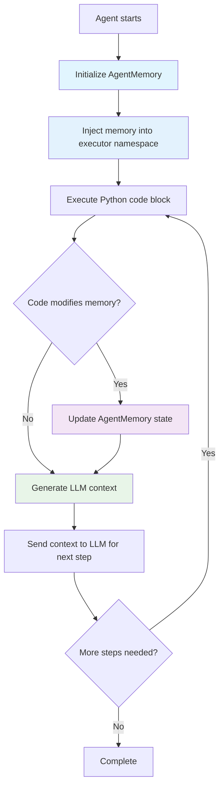

# CodeAgent Memory Architecture

The structured memory system that enables TinyCodeAgent to persist state, learn from execution, and avoid repeated failures across code execution steps.

## Core Memory System

### AgentMemory Class

Located in [`tinyagent/memory/scratchpad.py`](tinyagent/memory/scratchpad.py:19), `AgentMemory` provides three memory compartments:

```python
@dataclass
class AgentMemory:
    variables: dict[str, Any] = field(default_factory=dict)
    observations: list[str] = field(default_factory=list)
    failed_approaches: list[str] = field(default_factory=list)
```

#### Memory Compartments

| Compartment | Purpose | Methods |
|-------------|---------|---------|
| **variables** | Store computed values for later reuse | [`store()`](tinyagent/memory/scratchpad.py:51), [`recall()`](tinyagent/memory/scratchpad.py:64) |
| **observations** | Record learnings and discoveries | [`observe()`](tinyagent/memory/scratchpad.py:82) |
| **failed_approaches** | Track what doesn't work to avoid repetition | [`fail()`](tinyagent/memory/scratchpad.py:93) |

## Memory Lifecycle in CodeAgent



## Memory Injection Mechanism

### Namespace Injection

The key innovation is injecting memory functions into the Python execution namespace:

```python
# In TinyCodeAgent.run() method:
memory = AgentMemory()

# Inject memory into executor namespace
for name, value in memory.to_namespace().items():
    self._executor.inject(name, value)
```

### Available in Code Space

Python code can directly interact with memory:

```python
# Store intermediate results
result = complex_calculation()
memory.store("intermediate_result", result)

# Record learnings
if response.headers.get("content-type") == "application/json":
    memory.observe("API returns JSON format")

# Track failures
try:
    data = parse_xml(response.text)
except Exception:
    memory.fail("Tried XML parsing - API returns JSON")

# Retrieve stored values
previous_result = memory.recall("intermediate_result", default=None)
```

### Namespace Export

[`to_namespace()`](tinyagent/memory/scratchpad.py:144) exports memory for injection:

```python
def to_namespace(self) -> dict[str, Any]:
    """Export memory for injection into execution namespace."""
    return {
        "memory": self,           # The memory object itself
        "store": self.store,      # Convenience functions
        "recall": self.recall,
        "observe": self.observe,
        **self.variables,         # Direct variable access
    }
```

## Context Generation

### LLM Context Formatting

After each execution step, memory is converted to LLM-readable context via [`to_context()`](tinyagent/memory/scratchpad.py:110):

```python
def to_context(self) -> str:
    """Convert memory to a context string for the LLM."""
    parts = ["## Working Memory"]

    if self.variables:
        parts.append("\n### Stored Values")
        for name, value in self.variables.items():
            value_repr = repr(value)
            if len(value_repr) > 100:
                value_repr = value_repr[:100] + "..."
            parts.append(f"- {name}: {value_repr}")

    if self.observations:
        parts.append("\n### Observations")
        for obs in self.observations:
            parts.append(f"- {obs}")

    if self.failed_approaches:
        parts.append("\n### Failed Approaches (avoid these)")
        for approach in self.failed_approaches:
            parts.append(f"- {approach}")

    return "" if len(parts) == 1 else "\n".join(parts)
```

### Context Integration

The context is integrated into message flow in [`TinyCodeAgent.run()`](tinyagent/agents/code.py:324):

```python
# Update memory context in messages if needed
memory_context = memory.to_context()
if memory_context:
    messages[-1]["content"] += f"\n\n{memory_context}"
```

## Memory Usage Patterns

### Variable Persistence

```python
# Step 1: Calculate and store
data = fetch_api_data()
processed = transform(data)
memory.store("processed_data", processed)  # Persists across steps

# Step 2: Use without recomputation
data = memory.recall("processed_data")
analysis = analyze(data)
```

### Learning Integration

```python
# Discover API behavior
response = api_call(endpoint)
if response.status_code == 200:
    memory.observe(f"Endpoint {endpoint} returns {len(response.text)} chars")

# Later steps use observations
if "200 chars" in memory.observations:
    # Handle large response appropriately
    pass
```

### Failure Prevention

```python
# Track what doesn't work
try:
    result = deprecated_function()
except DeprecationWarning:
    memory.fail("deprecated_function() - use new_function() instead")

# Future steps check failures
if "deprecated_function()" not in memory.failed_approaches:
    # Won't execute failed approach again
    pass
```

## Integration with Execution System

### Executor Binding

Memory works with execution backends through namespace injection:

```python
# LocalExecutor receives memory functions
self._executor.inject("memory", memory)
self._executor.inject("store", memory.store)
self._executor.inject("recall", memory.recall)
self._executor.inject("observe", memory.observe)
```

### Memory Updates During Execution

As Python code executes, memory modifications persist:

```python
# Code executes in executor with injected memory
exec(code, executor_namespace)

# Memory object is updated in-place
# Variable stores, observations, and failures are recorded
```

## Memory Features

### State Validation

- **Identifier validation**: Variable names must be valid Python identifiers
- **Size limits**: Large values are truncated in LLM context
- **Empty detection**: Returns empty string when memory is empty to save tokens

### Performance Optimizations

- **Reference storage**: Variables stored by reference, not copied
- **Context efficiency**: Only non-empty sections included in context
- **Linear generation**: Context generation is `O(n)` where n is memory size

### Debugging Support

When `verbose=True`, memory operations are logged:

```python
def _log_memory_update(self, memory: AgentMemory) -> None:
    print(f"\n[MEMORY UPDATE]")
    print(f"  Variables: {len(memory.variables)} stored")
    print(f"  Observations: {len(memory.observations)} recorded")
    print(f"  Failed attempts: {len(memory.failed_approaches)} tracked")
```

## Memory vs Message History

| Aspect | AgentMemory | Message History (ReactAgent) |
|--------|-------------|------------------------------|
| **Structure** | Organized compartments | Linear conversation |
| **Programmatic Access** | Yes - code can modify memory | No - read-only to conversation |
| **State Management** | Explicit store/recall operations | Implicit through message accumulation |
| **Context Efficiency** | Summarized, relevant content | Full message history |
| **Use Case** | Complex computational workflows | Simple tool orchestration |

## Best Practices

### Memory Usage Guidelines

1. **Store expensive computation results** to avoid re-execution
2. **Record format discoveries** about APIs and data structures
3. **Track failure patterns** to prevent infinite loops
4. **Use descriptive variable names** for easy recall
5. **Clear memory** when starting unrelated subtasks

### Performance Considerations

- Memory persists across entire agent run
- Context generation happens after each execution step
- Large objects are truncated in LLM context (100 char limit)
- Empty memory returns empty string to save tokens

The CodeAgent memory system is essential for complex, multi-step programming tasks that require state persistence, learning from execution, and intelligent failure avoidance.
