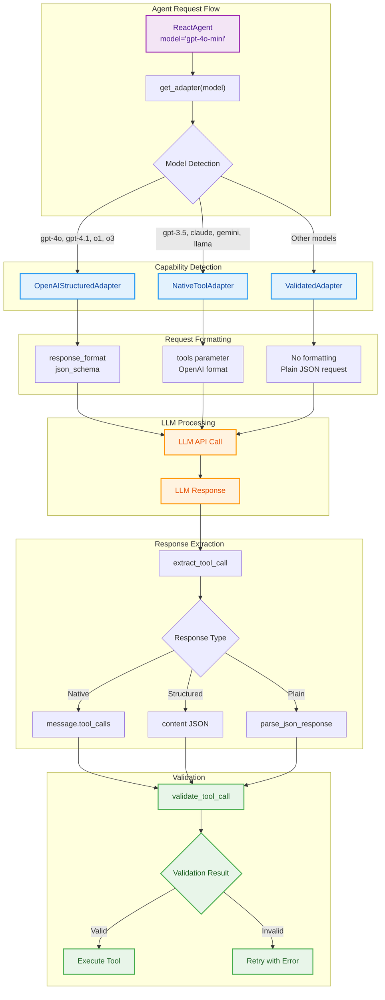

# Tool Calling Adapters

Bridge between LLM capabilities and agent tool execution - one interface, multiple strategies.

## Philosophy

**Adapt to model capabilities, not the other way around.** Different LLMs support different tool calling mechanisms. The adapter pattern abstracts these differences behind a single interface.

The system automatically detects model capabilities and selects the appropriate strategy:
- **Structured outputs** (GPT-4o, GPT-4.1, O1, O3) - Type-safe JSON schema validation
- **Native tool calling** (GPT-3.5/4, Claude, Gemini, Llama, Qwen, DeepSeek) - OpenAI-compatible API
- **Validated parsing** (Other models) - JSON response parsing with runtime validation
- **Parsed mode** (Minimal models) - Basic JSON extraction without validation

### Single Responsibility

Each adapter handles one specific interaction pattern:
1. **Format request** - Transform tools into model-specific API format
2. **Extract call** - Parse response to get tool/answer payload
3. **Validate arguments** - Ensure arguments match tool signature

### Capability Detection

Models are automatically detected by name pattern matching. No manual configuration required.

```python
# AUTO mode (default)
model = "gpt-4o-mini"       # -> OpenAIStructuredAdapter
model = "claude-3-5-sonnet"  # -> NativeToolAdapter
model = "llama-3-70b"        # -> NativeToolAdapter
model = "mistral-7b"         # -> ValidatedAdapter

# Explicit mode override
get_adapter("gpt-4o", ToolCallingMode.VALIDATED)  # Force validated
```

## Core Components

### ToolCallingMode Enum

```python
class ToolCallingMode(Enum):
    AUTO = "auto"          # Auto-detect based on model name
    NATIVE = "native"      # Force OpenAI-compatible tool calling
    STRUCTURED = "structured"  # Force structured outputs
    VALIDATED = "validated"    # Force parsed + validated
    PARSED = "parsed"      # Force parsed only
```

### ToolCallingAdapter Protocol

```python
class ToolCallingAdapter(Protocol):
    def format_request(
        self, tools: Sequence[Tool], messages: Sequence[dict[str, str]]
    ) -> dict[str, Any]:
        """Return kwargs to add to a chat completion request."""

    def extract_tool_call(self, response: Any) -> dict[str, Any] | None:
        """Extract a tool call payload from an LLM response."""

    def validate_tool_call(
        self, payload: dict[str, Any], tools_by_name: dict[str, Tool]
    ) -> ToolCallValidation:
        """Validate tool call arguments, returning normalized arguments."""
```

### ToolCallValidation

```python
@dataclass(frozen=True)
class ToolCallValidation:
    is_valid: bool
    error_message: str | None = None
    arguments: dict[str, Any] | None = None  # Normalized when valid
```

## Adapter Implementations

### OpenAIStructuredAdapter

For models supporting structured outputs (GPT-4o, GPT-4.1, O1, O3).

Uses `response_format: {type: "json_schema", json_schema: {...}}` for type-safe responses.

**Request Format:**
```python
{
    "response_format": {
        "type": "json_schema",
        "json_schema": {
            "name": "agent_response",
            "strict": True,
            "schema": {
                "anyOf": [
                    # Tool schemas (one per tool)
                    {"type": "object", "properties": {"tool": {...}, "arguments": {...}}},
                    # Answer schema (final response)
                    {"type": "object", "properties": {"answer": {...}}},
                    # Scratchpad schema (reasoning)
                    {"type": "object", "properties": {"scratchpad": {...}}}
                ]
            }
        }
    }
}
```

**Benefits:**
- Guaranteed valid JSON
- Type-safe argument validation
- No parsing errors
- Better instruction following

**Example models:**
- `gpt-4o-*`
- `gpt-4.1-*`
- `o1-*`
- `o3-*`
- `openai/gpt-oss-*`

### NativeToolAdapter

For models with OpenAI-compatible tool calling API.

Uses `tools` parameter with function definitions.

**Request Format:**
```python
{
    "tools": [
        {
            "type": "function",
            "function": {
                "name": "search_web",
                "description": "Search the web for information",
                "parameters": {
                    "type": "object",
                    "properties": {"query": {"type": "string"}},
                    "required": ["query"]
                }
            }
        }
    ]
}
```

**Response Handling:**
- Checks `message.tool_calls` for structured tool calls
- Falls back to `message.content` for final answers

**Benefits:**
- API-level argument validation
- Standard OpenAI interface
- Works with most modern models

**Example models:**
- `gpt-3.5-*`, `gpt-4-*` (non-structured)
- `claude-*`
- `gemini-*`
- `llama-*`, `qwen-*`, `deepseek-*`
- Models from OpenRouter, Anthropic, Google, Meta, Mistral

### ValidatedAdapter

For models that need post-hoc validation.

Parses JSON from response content and validates against tool schemas.

**Request Format:**
```python
{}  # No special formatting
```

**Response Handling:**
1. Extract JSON from response content using `parse_json_response`
2. Validate arguments against Pydantic model built from tool signature
3. Return normalized arguments or validation error

**Benefits:**
- Works with any JSON-generating model
- Runtime type safety
- Clear error messages

**Example models:**
- Models that don't support structured outputs or native tools
- Local models with basic JSON capability

### ParsedAdapter

Minimal adapter for basic JSON extraction.

No validation, just extract and return.

**Request Format:**
```python
{}  # No special formatting
```

**Use Case:**
- Models with minimal JSON support
- Testing and debugging
- When validation is too strict

## Usage Patterns

### Automatic Mode Selection

```python
from tinyagent.core.adapters import get_adapter, ToolCallingMode

# AUTO mode - detects based on model name
adapter = get_adapter("gpt-4o-mini")  # Returns OpenAIStructuredAdapter
adapter = get_adapter("llama-3-70b")  # Returns NativeToolAdapter
adapter = get_adapter("local-model")  # Returns ValidatedAdapter
```

### Explicit Mode Selection

```python
# Force specific mode
adapter = get_adapter("gpt-4o", ToolCallingMode.NATIVE)
adapter = get_adapter("llama-3-70b", ToolCallingMode.VALIDATED)
```

### Direct Usage

```python
from tinyagent.core.registry import tool

@tool
def search(query: str) -> str:
    """Search the web."""
    return f"Results for {query}"

tools = [search]
messages = [{"role": "user", "content": "Search for Python docs"}]

adapter = get_adapter("gpt-4o-mini")

# Format request
request_kwargs = adapter.format_request(tools, messages)
response = client.chat.completions.create(
    model="gpt-4o-mini",
    messages=messages,
    **request_kwargs
)

# Extract tool call
payload = adapter.extract_tool_call(response)

# Validate arguments
validation = adapter.validate_tool_call(payload, {t.name: t for t in tools})
if validation.is_valid:
    result = tools[0](**validation.arguments)
else:
    print(f"Validation error: {validation.error_message}")
```

## Response Payload Structure

### Tool Call Payload

```python
{
    "tool": "search_web",
    "arguments": {"query": "Python documentation"},
    "scratchpad": "User wants Python docs, use search tool"
}
```

### Answer Payload

```python
{
    "answer": "Python documentation is available at docs.python.org",
    "scratchpad": "Directly answering the question"
}
```

### Scratchpad-Only Payload

```python
{
    "scratchpad": "Thinking about what to do next..."
}
```

## Model Detection Patterns

### Structured Output Models

```python
STRUCTURED_MODEL_PREFIXES = (
    "gpt-4o",
    "gpt-4.1",
    "o1",
    "o3",
    "openai/gpt-oss"
)
```

### Native Tool Models

```python
NATIVE_TOOL_MODEL_PATTERNS = (
    "gpt-3.5", "gpt-4",      # OpenAI GPT
    "claude",                 # Anthropic Claude
    "gemini",                 # Google Gemini
    "mistral",                # Mistral AI
    "llama",                  # Meta Llama
    "qwen",                   # Alibaba Qwen
    "deepseek",               # DeepSeek
    "openai/",                # OpenRouter OpenAI
    "anthropic/",             # OpenRouter Anthropic
    "google/",                # OpenRouter Google
    "meta-llama/",            # OpenRouter Meta
    "mistralai/",             # OpenRouter Mistral
)
```

## Data Flow

```
User Request
    |
    v
+---------------+
| ReactAgent    |
+---------------+
    |
    v
get_adapter(model)  <-- Model capability detection
    |
    v
+-------------------+
| Adapter Selected  |
+-------------------+
    |
    v
format_request(tools, messages)  <-- Transform to model-specific format
    |
    v
LLM API Call
    |
    v
extract_tool_call(response)  <-- Parse response
    |
    v
validate_tool_call(payload, tools)  <-- Validate arguments
    |
    v
+-------------------+
| Tool Execution    |
+-------------------+
```

## System Architecture Diagram



## Design Choice Reasoning

### Protocol over Abstract Base Class

Using `Protocol` instead of ABC allows duck typing. Any object with the right methods works as an adapter.

### Frozen Validation Result

`ToolCallValidation` is frozen to prevent accidental mutation. Validation results should be immutable.

### AnyOf for Structured Outputs

Using `anyOf` in the schema allows the LLM to choose between:
- Calling a specific tool
- Providing a final answer
- Just reasoning (scratchpad)

This mirrors the ReAct pattern: Thought -> Action -> Observation.

### Separate Extract and Validate

Splitting extraction and validation allows:
- Reusable validation logic
- Different error handling strategies
- Easier testing of individual components

### Model Name Pattern Matching

Simple string prefix/suffix matching is:
- Fast (no API calls)
- Predictable
- Easy to extend
- Works across providers (OpenRouter, local models, etc.)

## Error Handling

### Validation Errors

```python
# Invalid argument type
{
    "tool": "search",
    "arguments": {"query": 123}  # Should be string
}

# Validation result:
ToolCallValidation(
    is_valid=False,
    error_message="ArgValidationError: query\n  Input should be a valid string"
)
```

### Missing Arguments

```python
# Missing required argument
{
    "tool": "search",
    "arguments": {}
}

# Validation result:
ToolCallValidation(
    is_valid=False,
    error_message="ArgValidationError: query\n  Field required"
)
```

### Retry Strategy

Agents typically retry with error feedback:

```python
validation = adapter.validate_tool_call(payload, tools_by_name)
if not validation.is_valid:
    messages.append({
        "role": "user",
        "content": f"Error: {validation.error_message}. Try again."
    })
    # Retry request...
```

## Design Principles

1. **Capability adaptation** - Use the best available mechanism
2. **Fail gracefully** - Validation errors become retry prompts
3. **Zero config** - Auto-detect model capabilities
4. **Explicit contracts** - Protocol defines clear interface
5. **Type safety** - Validate at runtime when model can't

This system ensures reliable tool calling across the fragmented LLM ecosystem.
