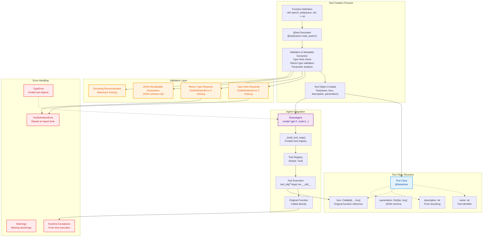

# Tool System Architecture

The tool system for TinyAgent - direct, explicit, no hidden magic.

## Philosophy

**Explicit over magic.** No global registry, no hidden state, no auto-discovery. What you see is what you get.

The `@tool` decorator returns a Tool object directly. Tools are first-class citizens that you pass to agents explicitly.

### Simple != Sloppy

A function decorator is a pattern everyone knows. An agent tool is just a function. That's the point.

The `@tool` decorator abstracts schema extraction, validation, and JSON conversion behind a single familiar interface. Tool modeling now uses Pydantic to keep the implementation explicit while preserving the simple user-facing API.

This is a deliberate choice: "hide" the complexity of tool infrastructure while keeping the developer interface dead obvious. Everyone already know how functions work. Now they're tools.

### Minimal Dependencies

The tool engine keeps the surface small and explicit. Pydantic is used to model tools and generate JSON Schema while keeping the decorator API unchanged:

```python
# Still direct and explicit.
import inspect
from pydantic import BaseModel
from typing import Any, Callable, get_type_hints


## Core Components

### Tool Class
```python
class Tool(BaseModel):
    name: str
    fn: Callable[..., Any]
    doc: str
    signature: inspect.Signature

    def __call__(self, *args, **kwargs) -> Any:
        # Direct proxy to underlying function
        ...

    @property
    def json_schema(self) -> dict[str, Any]:
        # JSON Schema derived from the function signature
        ...
```

### @tool Decorator
```python
def tool(name: str | None = None) -> Callable[[F], Tool]:
    # Returns Tool object, NOT the wrapped function
    # Validates type hints and return type
    # Emits warning for missing docstrings
```

### ToolDefinitionError
```python
class ToolDefinitionError(Exception):
    """Raised when tool definition violates requirements"""
```

## Usage Patterns

### Creating Tools
```python
#auto-infers name from function
@tool
def search_web(query: str) -> str:
    """Search the web for information"""
    return ddgs.text(query, max_results=5)
```

### Using Tools with Agents
```python
@tool
def query_db(sql: str) -> str:
    """Execute a SQL query and return results."""
    conn = sqlite3.connect("app.db")
    return json.dumps(conn.execute(sql).fetchall())

@tool
def transform_json(data: str, jq_filter: str) -> str:
    """Apply a jq-style filter to JSON data."""
    parsed = json.loads(data)
    # your transform logic here
    return json.dumps(parsed)

# Pass to agent - what you see is what you get
agent = ReactAgent(
    model="gpt-4.1-mini",
    tools=[query_db, transform_json],
)
```

## Validation Rules

### Fail-Fast Requirements
- **Type hints required** for all parameters
- **Return type required** - ToolDefinitionError if missing
- **Callable required** - Must be a function, not class or method
- **Parameters must be JSON serializable** - No complex types

### Soft Requirements
- **Docstring recommended** - Warning emitted if missing
- **Parameter descriptions** - Auto-generated from type hints if not provided

### Error Handling
```python
# This raises ToolDefinitionError
@tool
def bad_tool(arg):  # No type hints, no return type
    return "fail"

# This emits warning
@tool
def quiet_tool(arg: str) -> str:  # No docstring
    return "ok"
```

## Implementation Details

### Tool Creation Process
1. Function definition captured by decorator
2. Signature introspection extracts type hints
3. JSON Schema generated from annotations (via Pydantic helpers)
4. Validation checks applied (type hints, return type)
5. Tool object returned with metadata + schema

### Agent Integration
```python
# Agent builds tool map from Tool objects
def _build_tool_map(self) -> Dict[str, Tool]:
    tools = {}
    for tool_obj in self.tools:
        if not isinstance(tool_obj, Tool):
            raise TypeError("Expected Tool object")
        tools[tool_obj.name] = tool_obj
    return tools
```

### Tool Execution
```python
# Direct function call through Tool.__call__
result = tool_obj(arg1, arg2)  # Calls original function

# Agents use:
result = self._tool_map[tool_name](**arguments)
```

## Data Flow

```
Function Definition
    |
    v
+tool decorator
    |
    v
Validation & Metadata Extraction
    |
    v
Tool Object Created
    |
    v
Passed to Agent
    |
    v
Agent executes via Tool.__call__
    |
    v
Original function called
```

## System Architecture Diagram



## Design chopice reasoning

### Explicitness
- **Tools are visible objects** - What you see is what you get
- **Clear dependencies** - Agent needs are obvious
- **No hidden state** - No magic or auto-discovery

### Type Safety
- **Fail-fast validation** - Errors caught at import time
- **IDE support** - Better autocomplete and type checking
- **Runtime guarantees** - All tools have proper signatures

### Simplicity
- **Single tool class** - Clean and straightforward
- **Direct execution** - No indirection layers
- **Easy testing** - Tools are just objects

### Testability
```python
# Easy to mock
fake_tool = Tool(
    name="fake_search",
    func=lambda q: f"fake result for {q}",
    description="Fake search tool",
    parameters={"q": "string"}
)

agent = ReactAgent(tools=[fake_tool])
```


## Design Principles

1. **Explicit over implicit** - Pass tools directly
2. **Fail early, fail loudly** - Validate at import time
3. **Simple objects** - Tool class is just a data container
4. **Direct execution** - No magic, no indirection
5. **Type safety** - Require and enforce type hints

This system prioritizes clarity and reliability over convenience magic.
