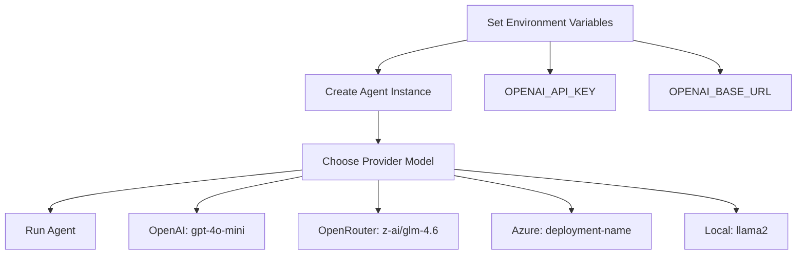

## Current Provider Architecture

The tinyAgent uses a flexible OpenAI-compatible API approach that supports multiple providers through environment variables:

### Core Implementation
Both [`ReactAgent`](tinyagent/agents/react.py:71) and [`TinyCodeAgent`](tinyagent/agents/code.py:135) initialize identically:
```python
api_key = self.api_key or os.getenv("OPENAI_API_KEY")
base_url = os.getenv("OPENAI_BASE_URL")
self.client = AsyncOpenAI(api_key=api_key, base_url=base_url)
```

## Provider Configuration Examples

### 1. **OpenRouter** (Already Configured)
From your [`.env`](.env:1) file, you have an OpenRouter API key. To use it:
```bash
OPENAI_API_KEY=sk-or-
OPENAI_BASE_URL=https://openrouter.ai/api/v1
```

Then use models like:
- `z-ai/glm-4.6` (as shown in [`documentation/examples/setup_andrun.md`](documentation/examples/setup_andrun.md:71))
- `anthropic/claude-3.5-haiku`
- `meta-llama/llama-3.2-3b-instruct`

### 2. **Direct OpenAI**
```bash
OPENAI_API_KEY=sk-your-openai-key
# No OPENAI_BASE_URL needed (uses default)
```
Models: `gpt-4`, `gpt-4o-mini`, `gpt-3.5-turbo`

### 3. **Azure OpenAI**
```bash
OPENAI_API_KEY=your-azure-key
OPENAI_BASE_URL=https://your-resource.openai.azure.com/
```
Models: Your Azure deployment names

### 4. **Local Models (Ollama/Llama.cpp)**
```bash
OPENAI_API_KEY=not-required
OPENAI_BASE_URL=http://localhost:11434/v1
```
Models: `llama2`, `mistral`, etc.

### 5. **Together.ai**
```bash
OPENAI_API_KEY=your-together-key
OPENAI_BASE_URL=https://api.together.xyz/v1
```
Models: `meta-llama/Llama-2-70b-chat-hf`

## Code Examples

### **Recommended: Environment Variables (via .env or shell)**
Set credentials externally, never in code:
```bash
# .env file or shell export
export OPENAI_API_KEY="sk-or-..."
export OPENAI_BASE_URL="https://openrouter.ai/api/v1"
```

```python
from tinyagent import ReactAgent

# Credentials read automatically from environment
agent = ReactAgent(
    tools=[your_tools],
    model="anthropic/claude-3.5-haiku"
)
```

### **Alternative: Constructor Override**
For cases where you need runtime credential switching (e.g., multi-tenant):
```python
import os

agent = ReactAgent(
    tools=[your_tools],
    model="z-ai/glm-4.6",
    api_key=os.getenv("CUSTOM_API_KEY"),  # Read from env, never hardcode
)
```
Note: `OPENAI_BASE_URL` must still be set via environment for non-OpenAI providers.

## Provider Switching Workflow



## Key Implementation Details

1. **Provider Agnostic**: Uses standard OpenAI Python library
2. **Easy Switching**: Just change environment variables
3. **Model Flexibility**: Provider-specific model naming supported
4. **No Code Changes**: Switch providers without modifying agent code
5. **Production Ready**: Standard pattern widely adopted

## Missing Provider Documentation

The `documentation/providers/` directory is empty and should contain configuration guides like this. The current provider examples are scattered in:
- [`documentation/examples/setup_andrun.md`](documentation/examples/setup_andrun.md:22-24) shows OpenRouter setup
- Code analysis shows the flexible base_url approach

Your current OpenRouter API key is ready to use - you just need to set the `OPENAI_BASE_URL=https://openrouter.ai/api/v1` environment variable to start using non-OpenAI providers.
