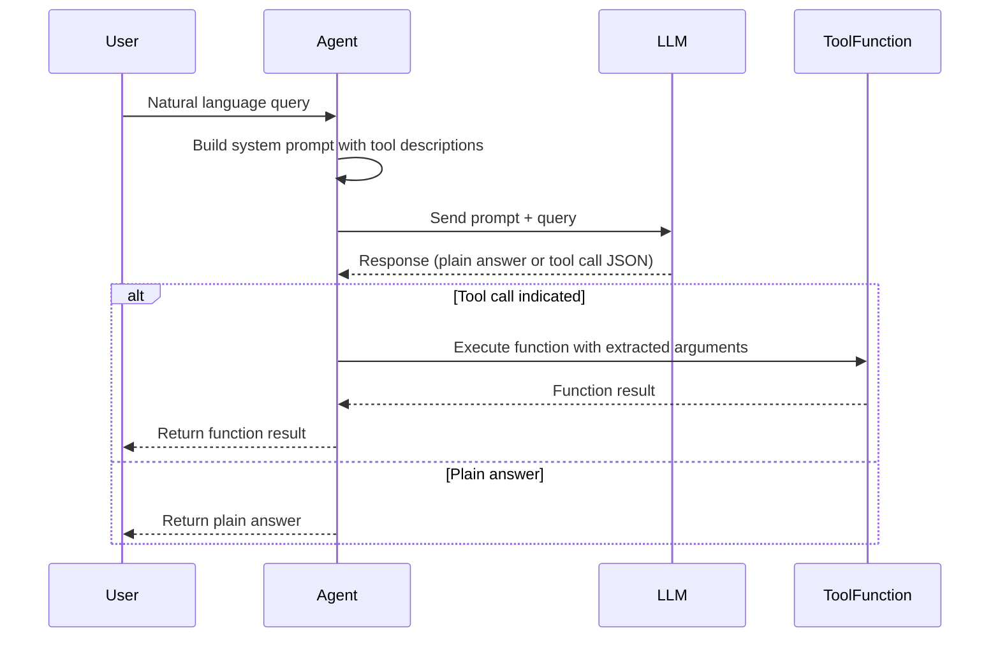

# tinyAgent Internal Flow

tinyAgent bridges natural language queries to Python function calls through these core steps:

## 1. Tool Decoration & Introspection

- Functions are decorated with `@tool`.
- The decorator introspects:
  - Parameter names and types
  - Return type
  - Docstring (description)
- It wraps the function in a `Tool` object, storing metadata and execution logic.

## 2. Agent Creation

- `AgentFactory.create_agent()`:
  - Accepts a list of tools or functions.
  - Converts functions to `Tool` objects if needed.
  - Registers all tools with an `Agent` instance.
- The `Agent` stores tool metadata and builds prompts accordingly.

## 3. Prompt Construction

- The `Agent` builds a **system prompt** embedding:
  - Tool names
  - Descriptions
  - Parameter schemas
- The **user query** is combined with this prompt.

## 4. LLM Query & Response

- The prompt is sent to an LLM backend (e.g., OpenRouter/OpenAI).
- The LLM analyzes the query and:
  - Returns a plain answer, or
  - Returns a structured JSON indicating a tool call with arguments.

## 5. Response Parsing & Execution

- The agent parses the LLM response.
- If a tool call is indicated:
  - Validates parameters.
  - Executes the corresponding Python function.
  - Converts the result to the expected type.
- Otherwise, returns the plain answer or a fallback.

---

## Sequence Diagram

