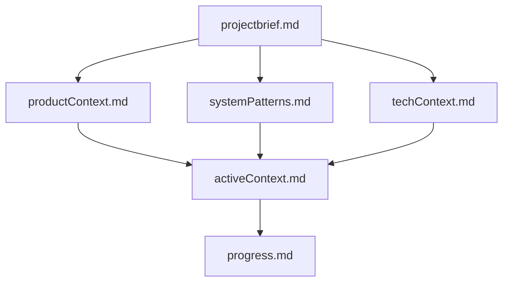

# Active Context

## Current Focus

Implementing Memory Bank system according to ai_instructions.md specifications

## Recent Changes

- Created core documentation files:
  - projectbrief.md
  - productContext.md
  - systemPatterns.md
  - techContext.md

## Next Steps

1. Establish progress tracking in progress.md
2. Implement documentation update workflows
3. Verify memory bank file relationships

## Active Decisions

- Using Mermaid.js for architecture diagrams
- Markdown as primary documentation format
- Strict UTF-8 encoding requirement

## Important Patterns

