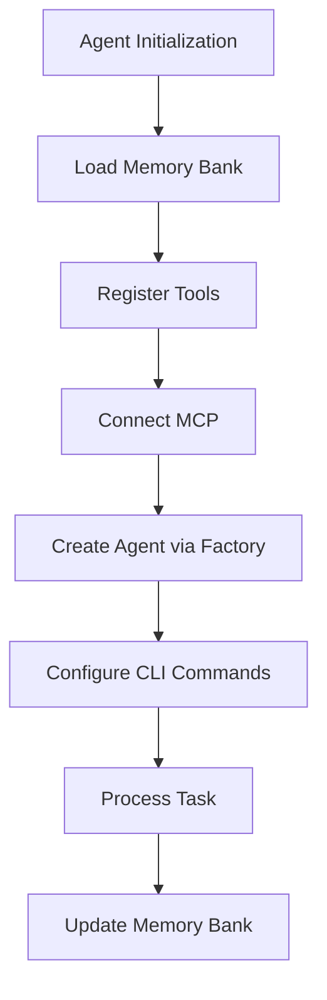

# System Architecture Patterns

## Core Patterns

1. **Decorator Pattern**: Tool registration via @tool decorator
2. **Factory Pattern**: AgentFactory/DynamicAgentFactory create preconfigured agents
3. **Model-Context Protocol**: MCP manager handles server connections
4. **Command Pattern**: CLI implementation in tinyagent/cli
5. **Facade Pattern**: Simplified interface for agent operations
6. **Memory Bank**: File-based context persistence

## Critical Paths

## Key Components

- AgentFactory: Creates preconfigured agent instances
- DynamicAgentFactory: Runtime agent configuration
- MCPManager: Handles server connections
- CLIHandler: Command pattern implementation
- Orchestrator: Coordinates agent collaboration
- MemoryBank: Context file loader/updater
