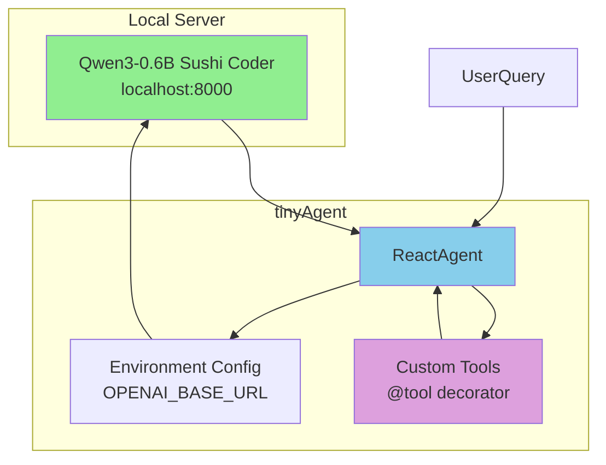

# Plan: ReactAgent with Qwen3-0.6B Sushi Coder (Local VLM)

## Overview
Create a new example demonstrating ReactAgent using Qwen3-0.6B Sushi Coder running on localhost:8000 via OpenAI-compatible VLM API.

## Files to Create

### 1. `examples/qwen3_local_demo.py`
Main example file demonstrating:
- Environment configuration for local LLM server
- ReactAgent with Qwen3-0.6B model
- Sample tools (math, string operations)
- Multiple query examples
- Verbose output for debugging

### 2. `.env.example.local`
Configuration template for local server:
```bash
# Local Qwen3-0.6B Sushi Coder (vLLM/OpenAI-compatible)
OPENAI_BASE_URL=http://localhost:8000/v1
OPENAI_API_KEY=not-needed  # Or your actual key
MODEL_NAME=Qwen3-0.6B-Sushi-Coder  # Adjust to match your server
```

## Configuration Details

ReactAgent setup for local server:
```python
import os

# Set environment variables BEFORE creating agent
os.environ["OPENAI_BASE_URL"] = "http://localhost:8000/v1"
os.environ["OPENAI_API_KEY"] = "not-needed"

from tinyagent import tool, ReactAgent

@tool
def add(a: float, b: float) -> float:
    """Add two numbers."""
    return a + b

@tool
def multiply(a: float, b: float) -> float:
    """Multiply two numbers."""
    return a * b

agent = ReactAgent(
    tools=[add, multiply],
    model="Qwen3-0.6B-Sushi-Coder",  # Match your server's model name
    api_key="not-needed"
)
```

## Example Queries
1. Simple math: "What is 5 + 7?"
2. Multi-step: "What is 12 times 8, then divided by 4?"
3. Chain reasoning: "If I have 15 apples and give away 40%, how many are left?"

## Architecture Diagram



## Implementation Steps

1. **Create examples directory** if not exists
2. **Write qwen3_local_demo.py** with:
   - Docstring with description
   - Environment setup section
   - Tool definitions using `@tool` decorator
   - Agent initialization
   - Example queries with expected outputs
3. **Create .env.example.local** with configuration
4. **Run ruff check/format** on new files
5. **Test execution** (requires local server running)

## Notes
- Qwen3-0.6B is a small model - expect shorter reasoning chains
- Local servers may need lower `max_steps` due to speed
- Temperature may need adjustment for code-focused tasks
- Verify exact model name with your local server's `/models` endpoint
