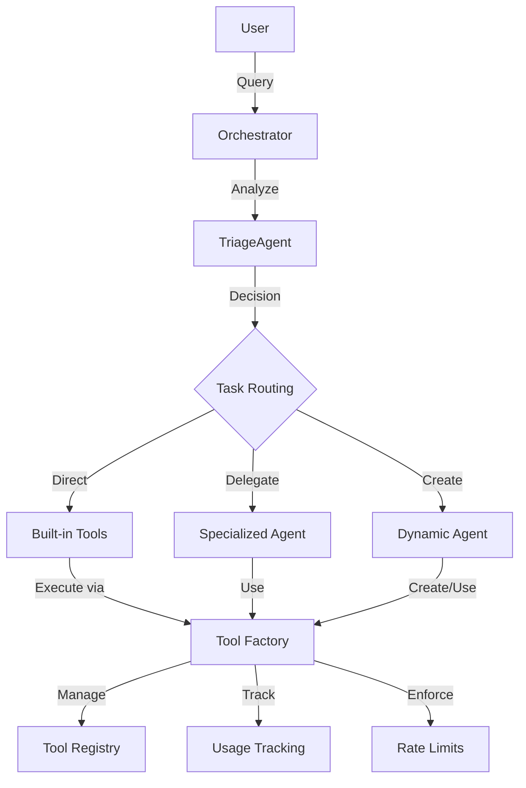

# tinyAgent Architecture

This document provides a high-level overview of the tinyAgent architecture, explaining its components, design principles, and how they work together.

## System Overview

tinyAgent is built around a modular architecture that separates concerns into distinct components with well-defined interfaces. The core of the system is the Agent class, which uses language models to select and execute tools based on user queries.



## Core Components

### Agent System

The Agent is the central component of tinyAgent. It:

1. Receives user queries
2. Formats prompts for the language model
3. Interprets the language model's responses
4. Selects and executes the appropriate tools through the AgentFactory
5. Returns results to the user

The Agent manages a collection of Tool instances and maintains a history of tool calls for debugging and analysis. The enhanced execution flow now ensures proper tool tracking and rate limiting through the factory:

```python
def execute_tool_call(self, tool_name: str, arguments: Dict[str, Any]) -> Any:
    """Execute a tool with error handling and history tracking."""
    try:
        # Execute tool through factory
        result = self.factory.execute_tool(tool_name, **arguments)
        
        # Log successful tool call
        self.history.append(cast(ToolCallResult, {
            "tool": tool_name,
            "args": arguments,
            "result": result,
            "success": True,
            "timestamp": time.time()
        }))
        
        return result
        
    except Exception as e:
        # Log failed tool call
        self.history.append(cast(ToolCallError, {
            "tool": tool_name,
            "args": arguments,
            "error": str(e),
            "success": False,
            "timestamp": time.time()
        }))
        raise
```

### Tool Framework

Tools are the functional units of tinyAgent. Each Tool:

1. Has a name, description, and parameter definitions
2. Implements a specific function
3. Can be called by the Agent when appropriate

The Tool framework is designed to be extensible, allowing for:
- Python-based tools using the `Tool` class
- Decorated functions using the `@tool` decorator
- External tools written in other languages

### Factory Pattern

The AgentFactory is a singleton class that manages tool registration, execution, and tracking:

1. Centralizes tool registration and management
2. Enforces rate limiting
3. Provides a consistent interface for tool execution
4. Tracks tool usage statistics

The factory pattern ensures that all tool executions are properly tracked and rate-limited, regardless of how they are called.

### Command-Line Interface

The CLI provides a user-friendly interface for interacting with tinyAgent. It:

1. Parses command-line arguments
2. Loads tools from various sources
3. Creates an Agent instance
4. Executes user queries
5. Displays results in a formatted way

The CLI supports direct tool invocation, interactive mode, and tool chaining using pipes.

### Configuration System

The configuration system manages settings for tinyAgent, including:

1. Model selection and parameters
2. API authentication
3. Tool rate limits
4. Parsing options
5. Logging configuration

Configuration can be loaded from YAML files, environment variables, or command-line arguments.

### Orchestration Layer

The Orchestrator coordinates multiple specialized agents to accomplish complex tasks:

1. The Triage Agent analyzes tasks and decides how to handle them
2. Existing tools can be used directly for simple tasks
3. Specialized agents can be delegated tasks that match their expertise
4. New agents can be dynamically created for novel tasks

This hierarchical approach allows for efficient task routing and specialization.

### Cross-Language Support

tinyAgent uses JSON as a universal interface between components, enabling tools to be written in any language. This is accomplished through:

1. **JSON Communication Protocol**: Tools receive JSON input and return JSON output, regardless of implementation language
2. **Manifest Files**: External tools are defined by manifest files specifying metadata and parameters
3. **Subprocess Execution**: The framework handles launching and communicating with external tool processes

This architecture enables integration with high-performance tools written in languages like Rust, Go, or C/C++, while maintaining a simple, consistent interface.

## Data Flow

The typical data flow through tinyAgent is:

1. User submits a query to the Agent (via CLI or API)
2. Agent formats the query into a prompt for the language model
3. Language model decides which tool to use and with what parameters
4. Agent parses the language model's response
5. Agent executes the selected tool through the factory with the specified parameters
6. Tool performs its function and returns a result
7. Agent returns the result to the user

## Design Patterns

tinyAgent employs several design patterns:

1. **Singleton Pattern**: Used for the AgentFactory to ensure a single instance for managing tools
2. **Decorator Pattern**: Used for the `@tool` decorator to transform functions into tools
3. **Strategy Pattern**: Used for parsers to allow different parsing strategies
4. **Factory Pattern**: Used in DynamicAgentFactory to create specialized agents
5. **Observer Pattern**: Used in the Orchestrator to monitor task status

## Modular Structure

The core package is organized into logical modules:

```
core/
  ├── __init__.py         # Core exports and version
  ├── agent.py            # Agent implementation
  ├── tool.py             # Tool base class
  ├── decorators.py       # Tool decorator
  ├── exceptions.py       # Custom exceptions
  ├── logging.py          # Logging configuration
  ├── chat/               # Chat functionality
  │   ├── __init__.py
  │   └── chat_mode.py    # Direct LLM interaction
  ├── cli/                # Command-line interface
  │   ├── __init__.py
  │   ├── colors.py       # Terminal colors
  │   ├── main.py         # CLI implementation
  │   └── spinner.py      # Progress indicators
  ├── config/             # Configuration management
  │   ├── __init__.py
  │   └── config.py       # Config loading and access
  ├── factory/            # Factory pattern components
  │   ├── __init__.py
  │   ├── agent_factory.py       # Tool and agent management
  │   ├── dynamic_agent_factory.py # Dynamic agent creation
  │   └── orchestrator.py        # Task orchestration
  ├── mcp/                # Model Context Protocol
  │   ├── __init__.py
  │   └── manager.py      # MCP server management
  ├── tools/              # Built-in tools
  │   ├── __init__.py
  │   ├── anon_coder.py   # Safe code execution
  │   ├── external.py     # External tools support
  │   └── ...             # Other built-in tools
  └── utils/              # Utility functions
      ├── __init__.py
      └── serialization.py # JSON serialization helpers
```

Each module has a specific responsibility and well-defined interfaces to other modules.

## Error Handling

tinyAgent includes a robust error handling system with a hierarchy of exception classes:

- `TinyAgentError` - Base exception class
  - `ConfigurationError` - Configuration-related errors
  - `ToolError` - Tool-related errors
    - `ToolNotFoundError` - Tool not found
    - `ToolExecutionError` - Tool execution failed
  - `RateLimitExceeded` - Rate limit exceeded
  - `ParsingError` - Parsing-related errors
  - `AgentRetryExceeded` - Agent retry limit exceeded
  - `OrchestratorError` - Orchestration-related errors
  - `AgentNotFoundError` - Agent not found

This allows for precise error handling and informative error messages.

## Extension Points

tinyAgent is designed to be extensible at several points:

1. **Tools**: New tools can be added by creating a Tool instance or using the @tool decorator
2. **Parsers**: Custom parsers can be created for different response formats
3. **MCP Servers**: New MCP servers can be connected to extend functionality
4. **Models**: Different language models can be used by changing configuration
5. **External Tools**: Tools in other languages can be integrated via the JSON protocol

## Recent Updates

### Tool Execution Flow

The tool execution flow has been updated to properly track tool usage and enforce rate limits:

1. All tool calls are now processed through the AgentFactory
2. The factory maintains a centralized registry of tools
3. Tool usage is tracked for monitoring and rate limiting
4. Rate limits are enforced at the factory level

This ensures consistent behavior across all tool invocations and provides better visibility into tool usage.

## Conclusion

The tinyAgent architecture is designed to be modular, extensible, and maintainable. It separates concerns into logical components with well-defined interfaces, making it easy to understand, use, and extend.

The use of modern Python features like type hints, dataclasses, and enums makes the code more robust and easier to maintain. The comprehensive error handling system allows for precise error handling and informative error messages.

The architecture is also designed to be backward compatible with the original tinyAgent API, making it easy to migrate existing code to the new architecture.
